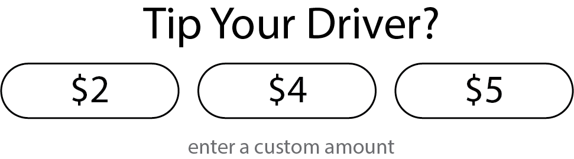

While working on the boat in West Palm Beach, Florida, I have had to take many Uber trips to get where I’m going, both for work and for personal adventures. Having done some work in the ride-share industry at Flywheel, I’m fascinated by the process. One of the things that I’ve been thinking about a lot is the science of how they pick the numbers to display at the end of the ride as suggested tip amounts. Here is a mock tip screen:

I’ve noticed that the amounts are designed to make you tip more than 20%. I’m sure they have done a bunch of research on this and figured out where people tip. I wish their algorithm for this were public because there are so many questions:

- Does the time of day factor into how they pick tip amounts?
- Does the weather? Do people feel like tipping better when it’s raining?
- Is the driver rating attached to how they pick the number of quantities?
- Is ride length or base fare a stronger predictor of tip amounts?
- Is car type a factor?
- Are tip amounts the same for each rider? And if not, is it possible to group riders by demographic to better predict amounts?
- Is the tip amount used to offset driver pay amounts?

These are just the top of my head questions. Some of the things I’ve seen, and I wish I had been screenshotting this screen, but the left-most value is usually a little too low, the middle amount is higher than 20% (the standard for tipping in the US), and the item on the far right is only slightly higher than the item in the center. The custom amount button is smaller and hidden under the buttons. The custom amount also has a generic number value to enter instead of something quicker.

My hypothesis is that they put an item too low on the left, and then have a bigger jump between that and the middle. The thought process here is that people don’t want to be seen as cheap, so they're likely to avoid the item on the left and opt for the middle. The gap between the middle and right item is smaller, so people won’t think about giving a slightly higher tip if the ride was good. Often, for me, the amount I think is right is NOT listed in the buttons. But I find myself selecting a button rather than entering a custom amount if I’m in a rush, because it takes me more work. This can be problematic if I’m in a rush to get to my next ride.
