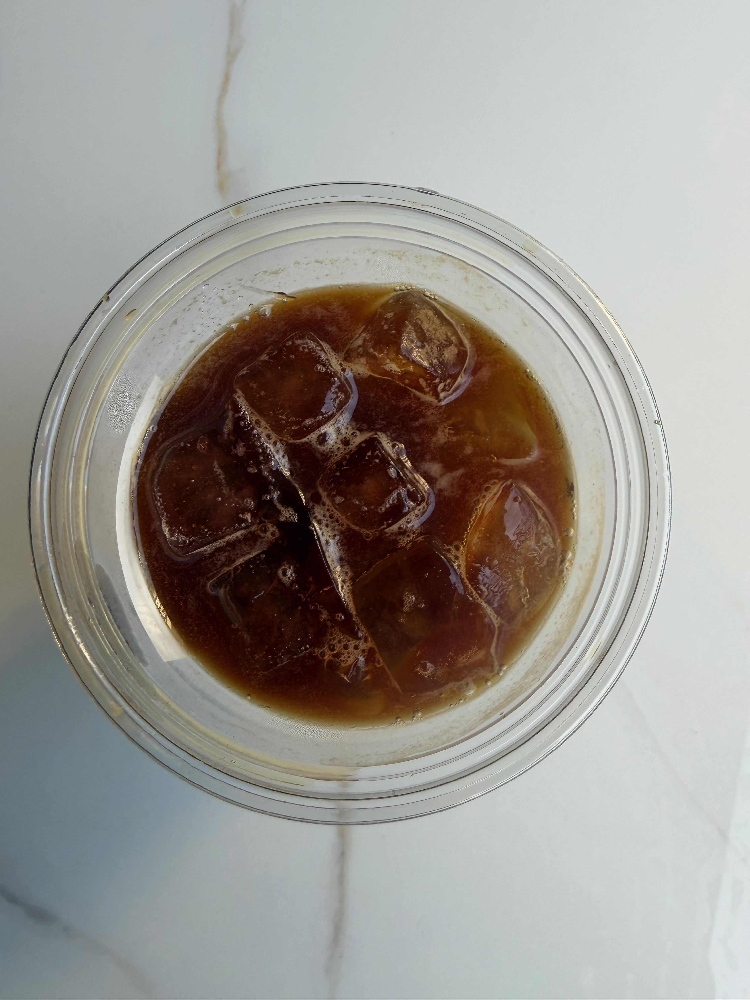
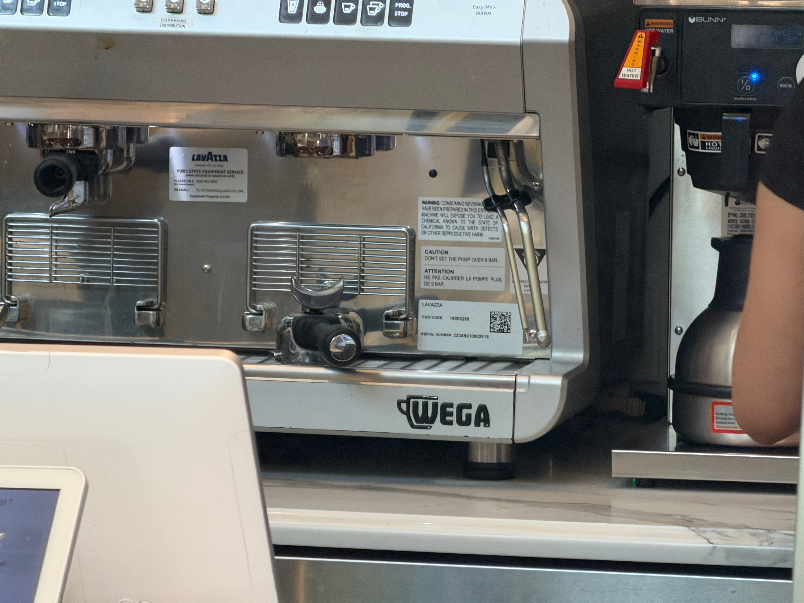
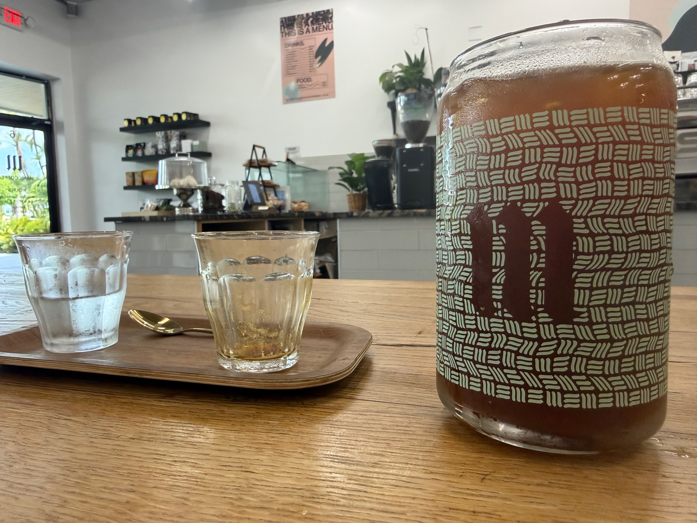
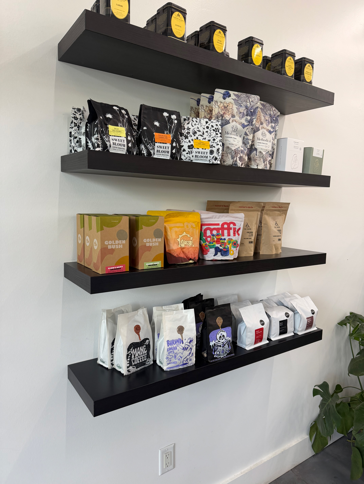
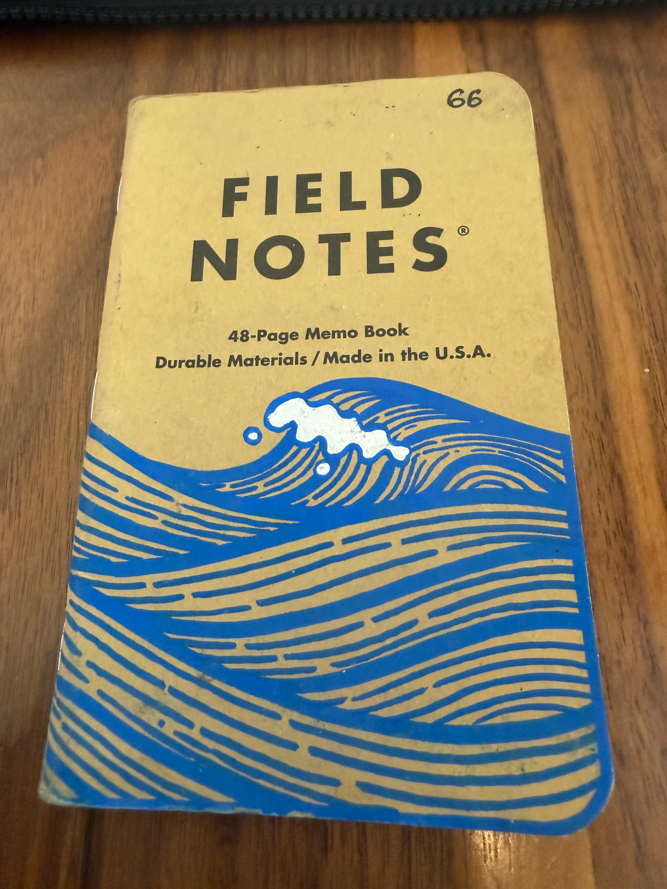
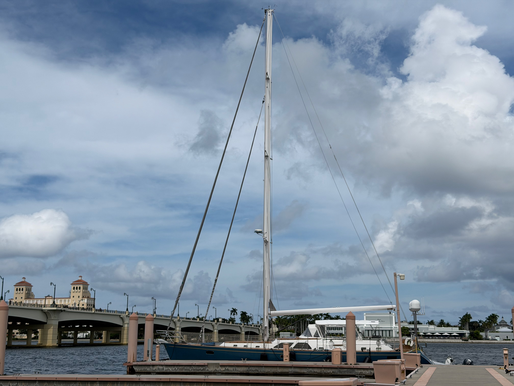
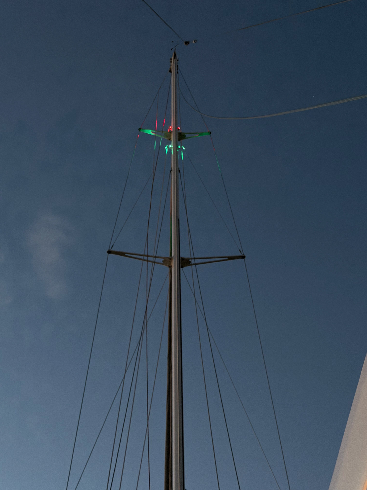

Still in Florida waiting on the boat to be ready to sail. She's not there yet, but she is getting there.

## Coffee

I made a conscious effort to try more coffee spots this week, to have a better review.

### [Pumphouse Coffee](https://pumphousecoffee.com)

West Palm Beach, FL
Rating: 3/5

They are based in West Palm Beach. They have a roaster and outside bar in downtown West Palm. The Bar is where I was able to try them as it is pretty darn close the marina and I like to avoid traveling in this heat unless I have to. Honestly, if you like a darker roast, this place wasn't bad. The bar has limited options, and despite the heat, nobody here seems to do iced pourovers. Still solid option if you want to uplevel starbucks in the downtown area.

### [Via Roma Cafe](https://viaromacafe.com)

Palm Beach, FL
Rating: 1/5

Via Roma is in Palm Beach, which is even more Ritzy than West Palm Beach. I was not ready for that. This cafe is tucked behind a rare book dealer and next to a cigar lounge. They don't list it on their site, but they carry Lavazza coffee, which is not great and is traditionally very dark. The machine isn't a higher-level machine.

Honestly, this place is all about the decor. It has beautiful walls with framed photos and plants, and high ceilings. The coffee was sub-par, the food looked store-bought, and I was very disappointed.

I would say pass unless you are there for the rare books and need a coffee. (There also isn't much room to sit.)

### [Mane Coffee](https://www.mane.coffee/)

Boca Raton, FL
Rating: 2.5/5

It took me about 1.5 hours each way to get to Mane, because I took the bus, so I probably shouldn't be as salty as I am, but it is hard. The staff is incredibly friendly and chatty so despite the line only being like 3 groups deep when I showed up, it took a solid 15 minutes to get my order in. Still, I felt seen and heard when I ordered so that was great.

They have at least two coffees on at all times for espresso, which is awesome. And unlike Composition (the bar for the area), they had a natural coffee on the menu. I tried to order a natural iced americano but somehow got an espresso too. I thought 10 bucks was expensive for an iced americano, but it is 8 at Composition for the boulder blend, so I didn't think too much of it. It was a Kenya from [The Barn](https://thebarn.de), and I'm not sure if it was the way it was pulled or the bean, but it honestly just tasted like water, both in the espresso shot and the iced americano. There was no real flavor to either.

On the way out, I went to go buy some beans, but exluding the Barn (because I didn't even look), there were no straight naturals. There were a natural co-ferment and a couple of blends, but everything else was washed. They have some of my favorite roasters in [Brandywine](https://www.brandywinecoffeeroasters.com), [Sweet Bloom](https://sweetbloomcoffee.com), [Dak](https://www.dakcoffeeroasters.com), and [Methodical](https://methodicalcoffee.com), but the beans were almost all washed. I ended up stopping at Composition on the way home to buy some Prodigal.

Also, the place was nice and large, but because of all the hard surfaces, it was pretty loud, so it was not the best for working.

### [Wells Coffee](https://wellscoffees.com)

Fort Lauderdale, FL
Rating: 3/5

This place has some nostalgia for me as I've been coming for years. I found out about them through a designer on Dribbble, Steve Wolf, who did some branding for them that I always thought was cool.

I got there last thing on Sunday, 3:55, and they close at 4. I was not even the last person in line, so I tried to order quickly and ended up getting an iced latte with there Padestrian espresso which was very good. They had no naturals on, which again is a knock from me, and they were out of their natural beans.

Still, I really like this place, and for bagged coffee their prices tend to be on the more reasonable side than some of the other places I've seen recently (their natural was 23.50 and passengers was nearly 10 bucks more for a smaller quantity).

### [Composition Coffee](https://www.compositioncoffee.com)

West Palm Beach, FL
Rating: 4.5/5

I still love this place. I am worried because they are talking about starting to roast their own beans, and that makes me a little scared. So many people do this and end up with subpar coffee because they are committed to their own beans. Yes, it is possible to get this right, but it is also possible to get this VERY wrong. However, if I were to pick a shop that has enough attention to detail to get this right, this would be the place. I think I went there 3 times last week.

## Work

### Authentic Auctions

My favorite type of work is experimentation. I love testing new things to see how they react, developing hypotheses about what could happen, and testing the result. We did this we a brand new build from a van manufacturer out of Nicholasville, KY. We listed a brand-new van on Bring a Trailer to see if the market was there for it. We were pretty disappointed with the result. It finished well below the vehicle's reserve. It appears that the typical market on BaT is more for used (even if only slightly) vehicles with a bit of a bargain.

### Hanukkah Coffee Box

I've been talking about this for a while, but I'm just not going to be able to get to my goal of doing a smaller box in July. I'm too busy with other projects, but if you want to sign up for the 2026 box, you can do so on the [website](https://www.hanukkahcoffeebox.com).

### VLOG

Working on Episode 3. This one is about how we got here. Why did my sidewalk cracks happen? Can I diagnose some of the root causes of them.

### [Parrie](https://parriehelp.com/)

This project is moving along. I was able to build out a bit of the admin dashboard over the weekend and have a way to add venues and restaurants. Also working on the way to add groups and manage groups.

Performance is also becoming something I want to care about as we continue to work on this.

Also, I need to spend some time actually working through the the design and identity as it just looks like AI created app at this point and I want to add a bit more character.

### [CNContactExporter](https://github.com/zacharyc/CNContactExporter)

This is a side project that is part of the Dex project I want to work on to really extend the way we work with contacts. This simple app exports your contacts from CNContactStore in a way that allows you to archive them. This week I added support for Markdown files with head properties. This is akin to the way Obsidian works with data. It's also significantly more human-readable than other forms of the export (at least for me).

## Moments

FN-66 is done for me. This was a custom drawn notebook from Ether Designs.

Just a picture of Grace sitting on the dock

We got our navigation lights working!
