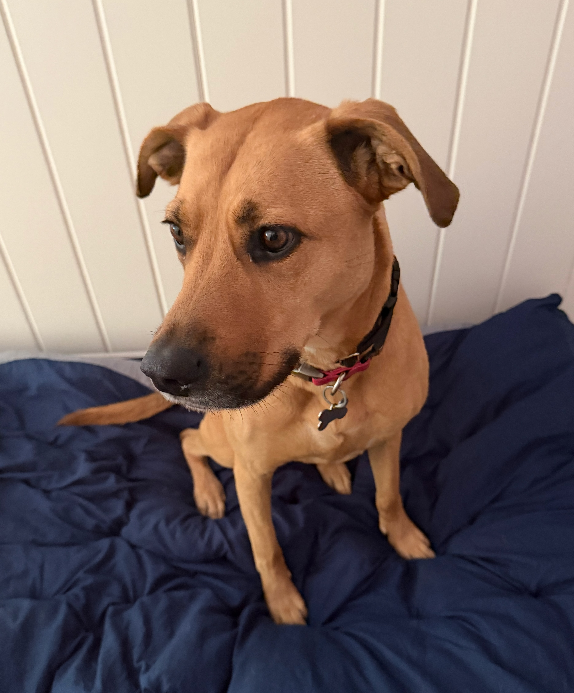
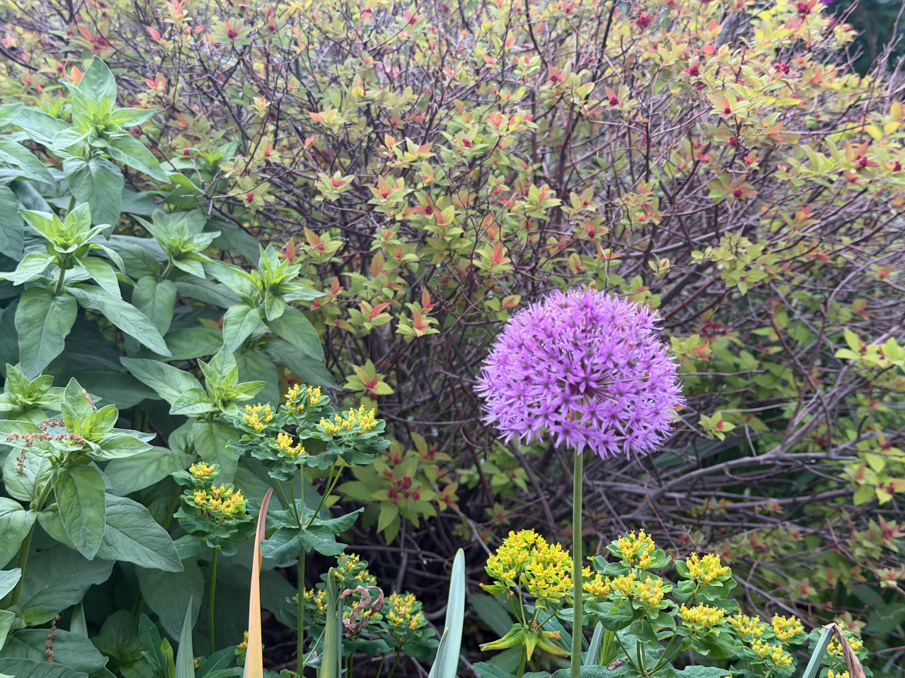
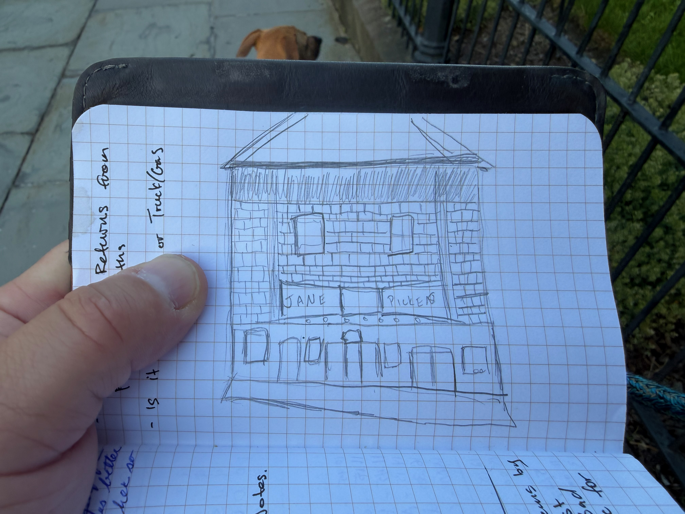

## Coffee

This has been a relatively lackluster coffee week experience until today, and technically, this is already the next week, but I'm going to share anyway.

I'm in West Palm Beach to pick up and deliver the boat from Florida to Newport, and I have some extra time on my hands as the boat is still getting buttoned up, so I searched for a coffee company and found this place: [Composition Coffee](https://www.compositioncoffee.com). They are pretty darn awesome. Very well done inside, and great-tasting coffee. I wish I could have more than two cups. They don't roast, so they won't be in the box, but if you happen to be in the area, I would say it is well worth the trip. I had a [prodigal coffee](https://getprodigal.com) [boulder blend](https://getprodigal.com/products/boulder-blend-1) in my iced americano. Glad I got to try them.

I'm hoping to ask more about this place on the way out the door if they aren't slammed (which they currently are).

_Update:_ Secret news, they are in the process of developing their own roaster. I'm super excited to try it when they release it.

_Warning:_ next week will not be good for coffee either, as I will be on a boat doing a delivery and won't have a bunch of opportunities to try great coffee.

## Work Updates

- We are continuing to list more and more cars on [Authentic Auctions](https://www.authenticauctions.com). Despite having several auctions end without a sale, we have been able to find home for the vehicles post auction. I'm going to write a post about how this site is currently built to save a bunch of money, and why I'm thinking about redoing it for better customer experience.
- I'm working on a project with my friend Damon called Parrie, which is the Jamaican word for Gathering. [Parrie](https://www.parriehelp.com) It is the site, and it is super duper beta, meaning some of the functionality is up, but much of it is not ready. The goal of this project is to build something to aid people with finding trusted restaurants and locations around the country to host large events.
- For the next week, I'm going to be sailing a boat as a crew member. While the boat is my parents' and this could technically be called nepotism, I keep trying to believe that it is not. I'm willing to do the boat trip, and technically I've done it more times than anyone else, so I have certain knowledge that others doing the delivery do not have. I also ask for the crappiest jobs, but I wonder if they are afraid to give them to me.

## Weekly Goals:

1. I've secretly been putting together a vlog called [Zack's Cracks](https://www.youtube.com/@zacks_cracks) about how I feel like I've let myself and my life get a little out of hand at my current age and it is time to refresh my priorities and get things back in order. I've filmed content for a second episode, but haven't put it together. This is a major goal for me.
2. I want to continue finding a way to journal, even when on the boat.
3. It's funny, but as we move on to using AI to code a lot more of our work (and I'm guilty of it), I find myself wanting to spend more time becoming an expert at some of the technologies that I would consider past their prime. I miss being an expert in certain technologies. To that end, I'm going to spend some time learning more CSS, TypeScript, and various other languages and frameworks that are not as important to be expert in as we move further towards AI helping with generating the code and us reviewing it.
4. This is sort of covered above, but I want to spend time reading!

## Moments

This is the last time I see Coco before the boat trip.

Such a cute flower on our walk.

Small sketch of Jane Picken's, the last movie theater in Newport.
