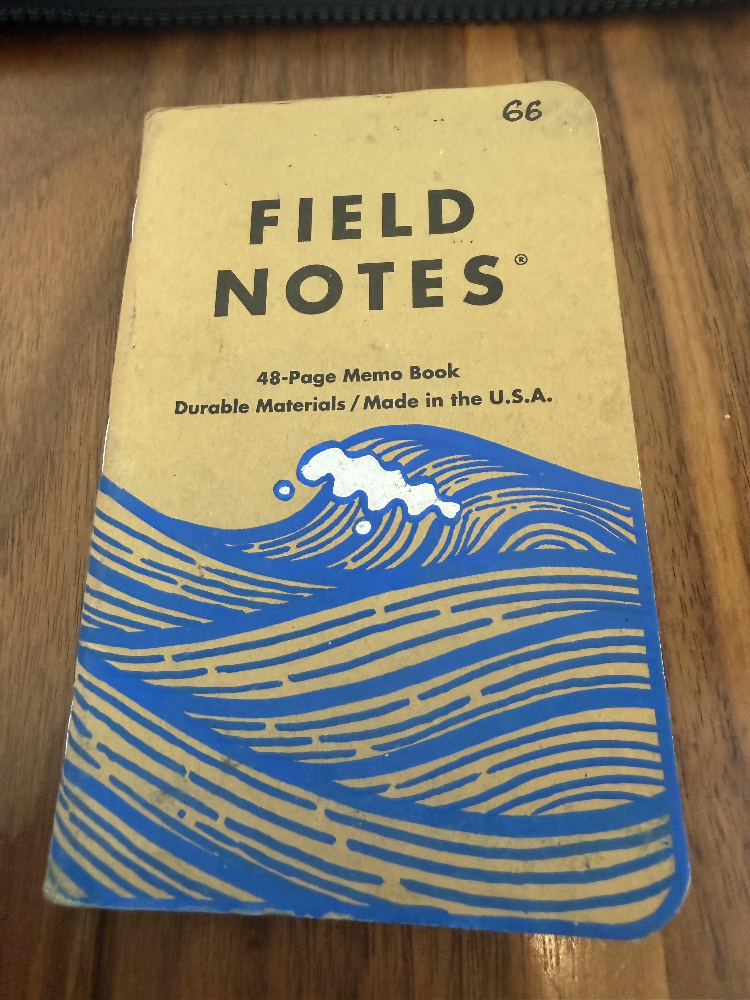
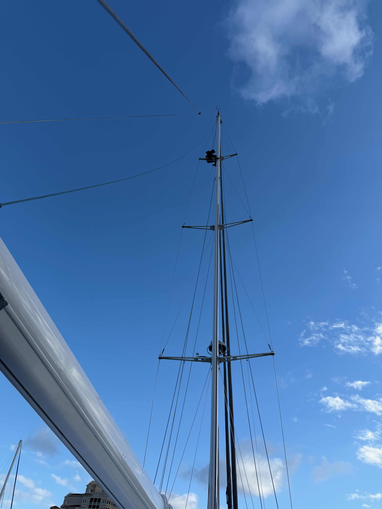
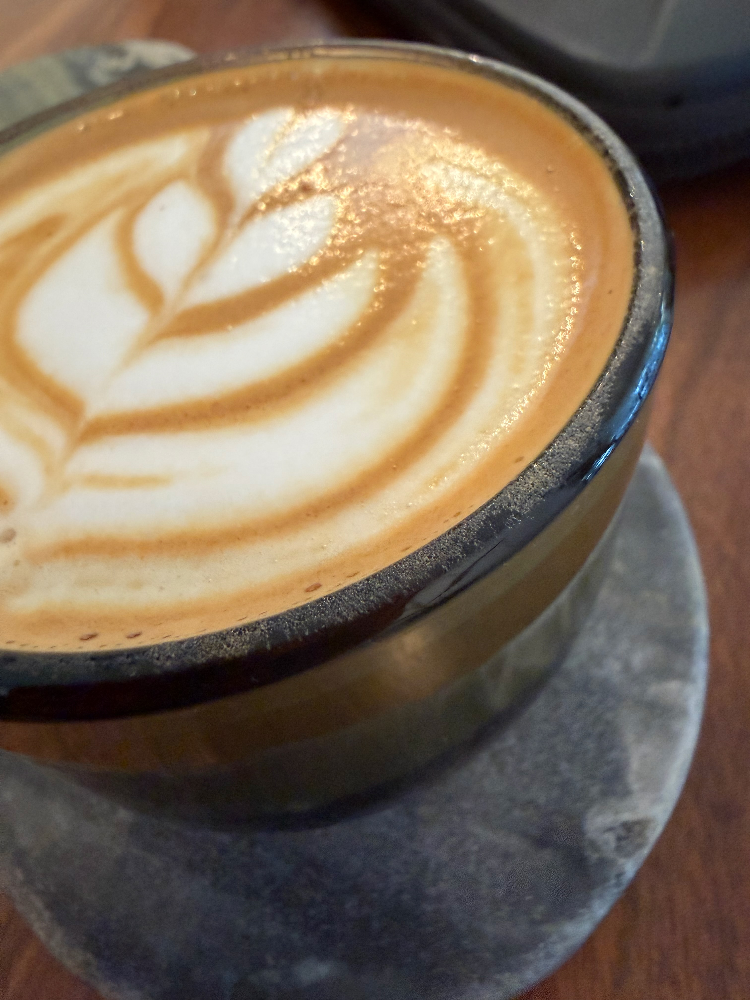
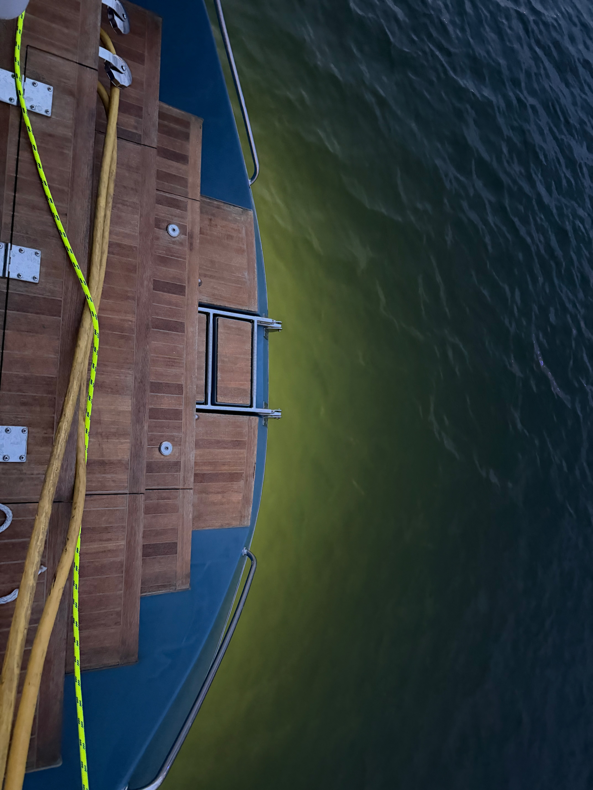

This week finds me still in Florida and despite my vast hatred of this heat, I'm actually enjoying my stay for the most part. I've had some time to really spend on my computer because there isn't much else for me to be doing. Yes, there are some boat tasks, but I'm not really a mechanic or boat worker. I'm just here for the sailing. So while the boat is getting fixed and I can learn some things, I'm not super useful.

## Coffee

I'm still enamored with [Composition Coffee](https://www.compositioncoffee.com), though I can't do the pastries anymore. I'm just here for the coffee. The place is comfortable and easy to work in, and I enjoy the time I get to spend here.

They are closed on Sundays, wondering if it is a religious thing like Sweet Bloom, but so I had to try somewhere else yesterday. I tried [Carmela Coffee](https://www.carmelacoffee.com) yesterday. This is a very different shop, so I tried a less sweet version of their Tiramisu Latte, and it was actually quite good for what it was, but was more dessert than coffee drink.

It's looking like I might be here a couple more days, so if anyone has any recommendations, please send them over.

## Work

Let's talk about boat work first. Several projects that I've been on include cleaning the power lines, working on bilges, and organizing the boat. When it comes to being docked on land, my usefulness is somewhat limited. When we are off at sea I think I will be much more helpful. I wish there were some more electric or plumbing work I could learn about, but we just haven't had the time or ability to teach me yet.

Other work updates:

- [Parrie](https://www.parriehelp.com) help got a couple of big updates over the weekend including a bunch of new verified restaurants in certain cities. I'm also working on adding groups and finding a way to let people join and work in them.
- I released the second video in vlog, even though I called it a podcast, [here](https://youtu.be/-rPFsf875Z8?si=z3YWW3wxJarwM1Lm). I started working on episode 3 already.
- I'm focusing on learning more about TypeScript. I got a new book, and I am still at the very beginning, but I'm better understanding some of the basics that the tooling I've used has handled for me.
- I'm on the second-to-last page of my 66th daily Field Notes companion. Will hopefully finish up today and be on 67. This one has taken longer than usual, and most of it is text.

## Moments

Current edition of field notes, art done by ether design.

Crew mate Elmer fixing our mast lighting

Cortado from Composition

Underwater lights on Grace are beautiful

Sunset at the marina
