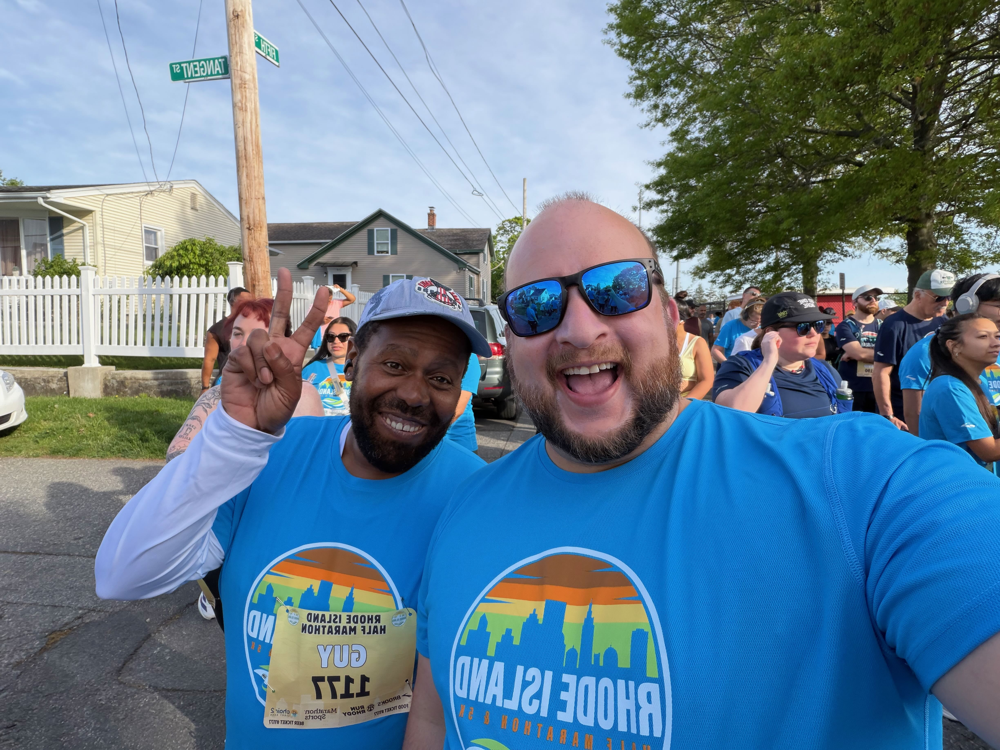
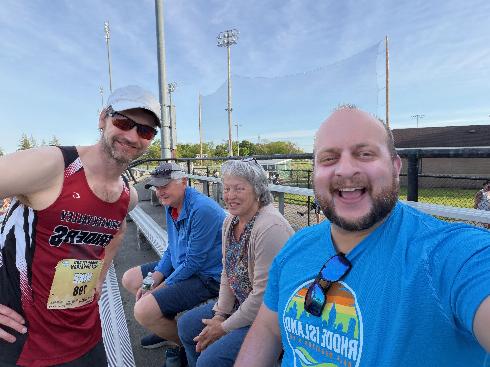
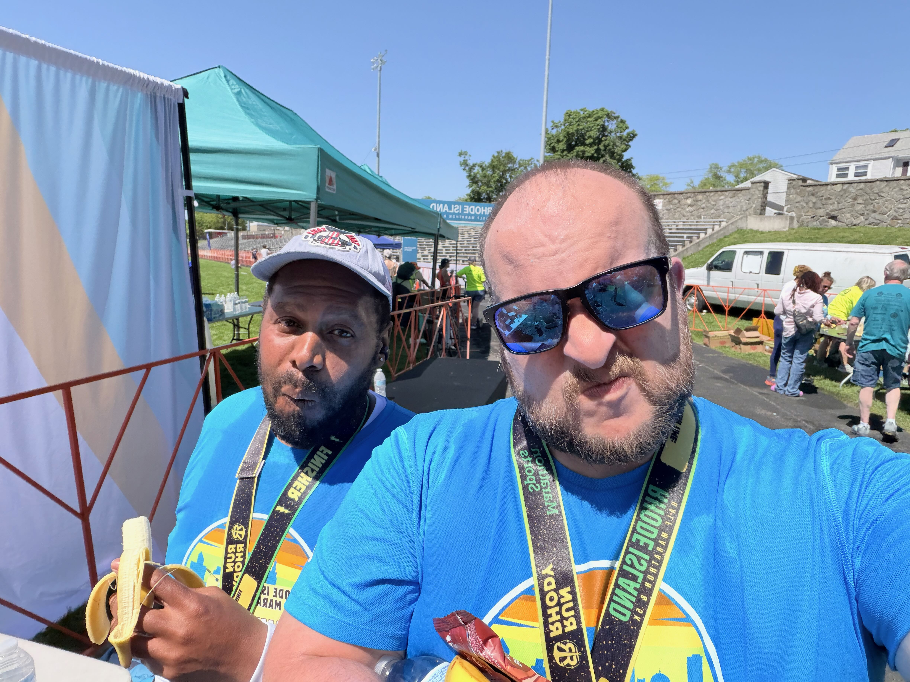
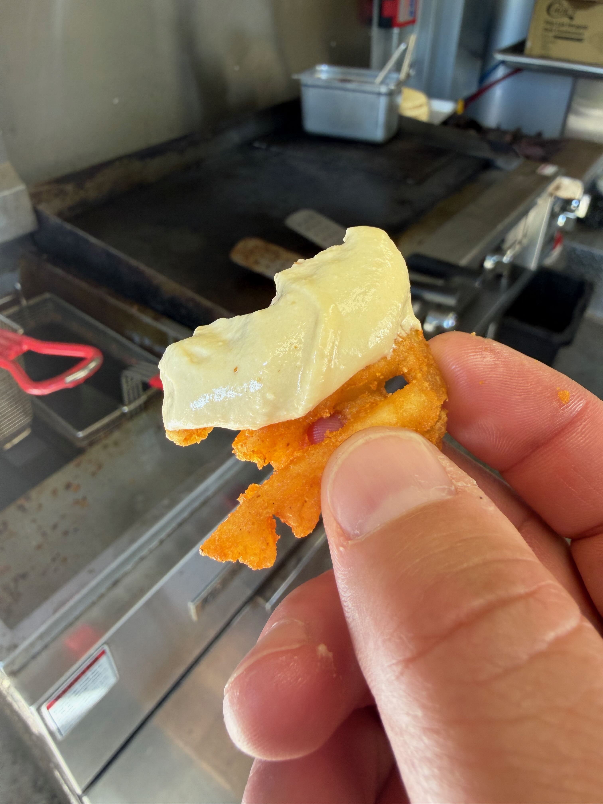
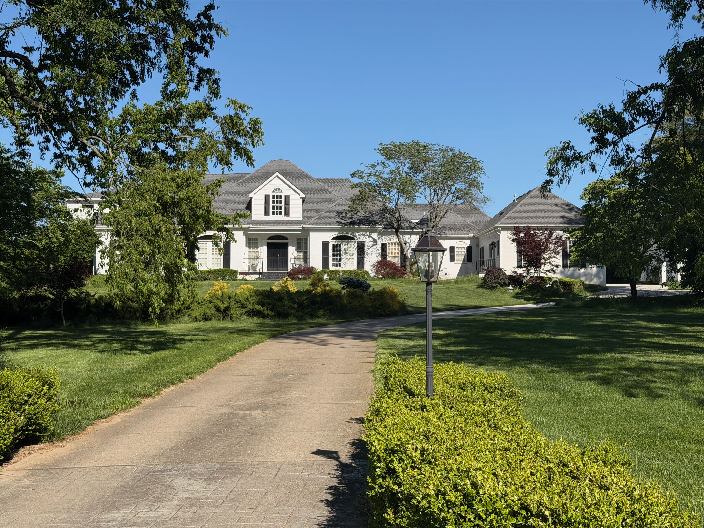
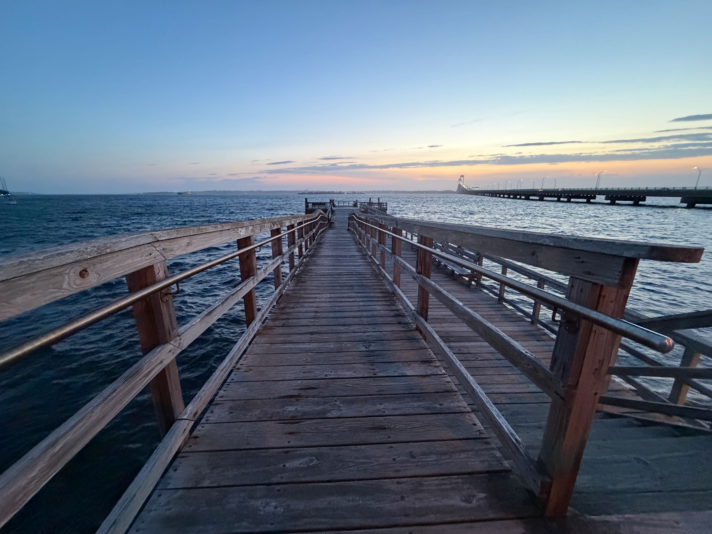

Last week was a crazy adventure, starting on Sunday with Mother's Day. The whole family got together in CT, and it was a ton of fun hanging with the kids and dogs.

However, from there it only got crazier as Dan and I decided to take a trip for [Authentic Auctions](https://www.authenticauctions.com) to Kentucky to photograph some Adventure Vans in the town I lived in when I was a sophomore in High School. It has changed so much.

## Coffee

I only have one update this week. I've been making the vast majority of my coffee at home with a [Flaire](https://flairespresso.com) but have gone out once or twice.

The biggest one was today when I tried the [Nitro Bar](https://thenitrocart.com) Anniversary Latte. They have been around for 10 years and have released a special latte to celebrate their anniversary. I love that the whipped cream on top is pink! Had to try it for that reason, but truthfully, the latte was way too sweet for me.

We were so busy on our trip that I didn't get to try any great coffee places, but if I had, I would have gone to [The Greenery](https://thegreenerylex.com), this place looks rad.

## Other Updates

- I'm doing a small sticker trade program. Do you have stickers lying around that you are willing to part with? I created a [form](https://tally.so/r/VLb5ZN) where you can give me information, and I'll send out a bunch of stickers. So far, only two people have responded, and I plan to send those out today.
- Working on a new project with a friend called [Parrie](https://parriehelp.com) to help SDRs and other field reps plan events. We have a boatload of features to do there, but it is a start. More to come on that soon.
- I ran/walked 12.5 miles yesterday as part of a 1/2 Marathon. I was too slow to finish the full 13.1 miles in the allotted time, but I came home and did the rest with Coco. I can barely walk today.
- I've been taking the past couple of weeks off from manual labor for various reasons, but I should be back on that shortly. In the meantime, I've also been dusting off some coding skills with [LeetCode](https://leetcode.com) and I forgot how much I loved this stuff. I can get lost in problems.
- Now that Coco is 4 months post-surgery, we are getting back to our walking and have become obsessed with winning the Fi Collar competition among the family. We are averaging

## Moments

Before:

After:

New invention from Alp at the Tolia Food Truck, Zohan Fries:

Seriously good, just french fries and hummas.

Picture of my old home from KY:

Sunset in Newport:

