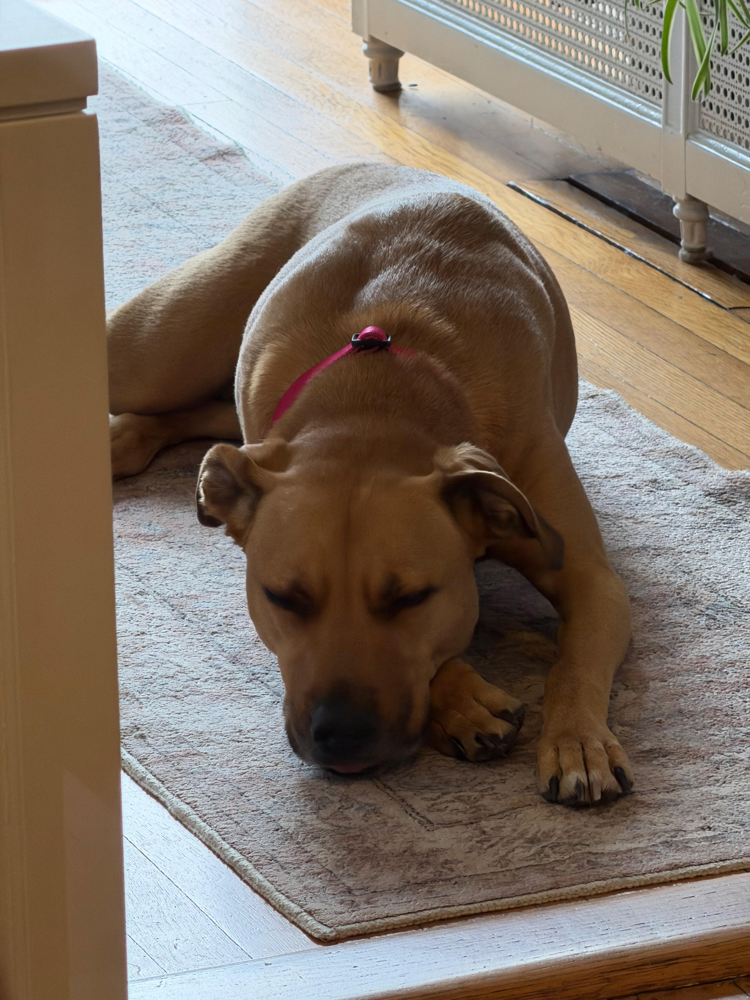

## Coffee Updates

Several Weeks ago, I ran/walked a half-marathon in Providence (mostly walked). While I was up there, I was able to grab a coffee at [The Brown Bee](https://brownbeecoffee.com) with a good friend after the race. I got the Pistachio Latte and actually thought very highly of it, though trying to eat one of their pastries without making a mess is impossible. This place is very Brown University, but worth checking out.

Aside from that, I've been drinking crappy coffee or making it at my house with my Flaire.

## Work Updates

### Parrie

I'm working on a venture with my friend Damon we are calling Newport Technology Group. The goal of this project is very interesting. We are taking an idea and running with it for 3 months to see if we can make it successful. If we can, we will spin it off; otherwise, we will move on to the next project.

Our first project is called [Parrie](https://parriehelp.com) and is focused on helping SDRs with event planning, and really anyone else who needs to find places to hold events when traveling. The goal is to have a database of locations that can be rated and shared with friends and coworkers.

This project is still in its infancy stage and a lot of the coding has been done by Claude, so please have that in mind if you visit.

### Rollin Renovations

We are coming back from a longer break to get back to work on projects. We are finishing up some paperwork and should be back to construction very soon.

### Authentic Auctions

We are running auctions like crazy. We have a lot of vans in the pipeline right now, as well as some fun sports cars. Currently have a Thor 4x2 (better gas mileage) on auction.

We also have some merch coming, which is exciting.

## Moments

Umbrellas in Newport

Coco taking a nap at work

Overlooking Eastons beach in Newport
