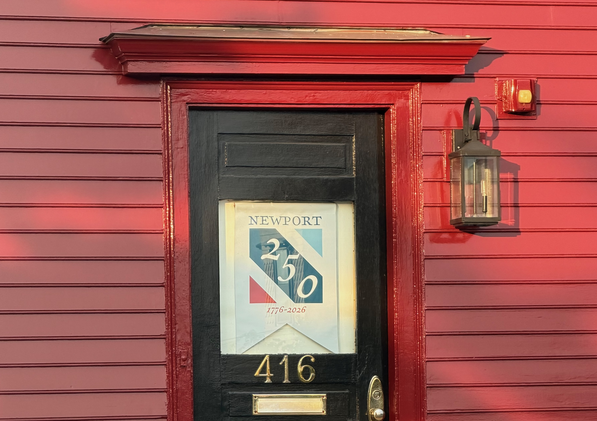
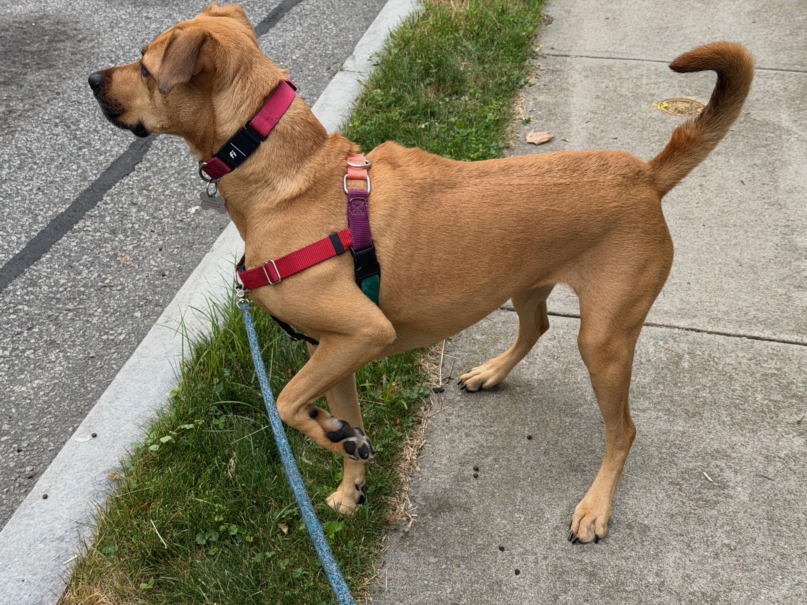
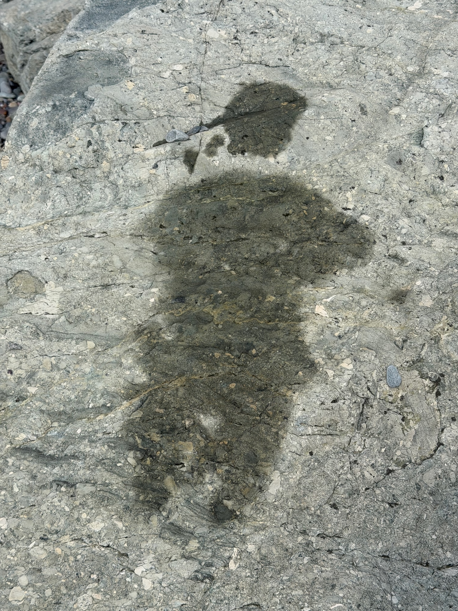
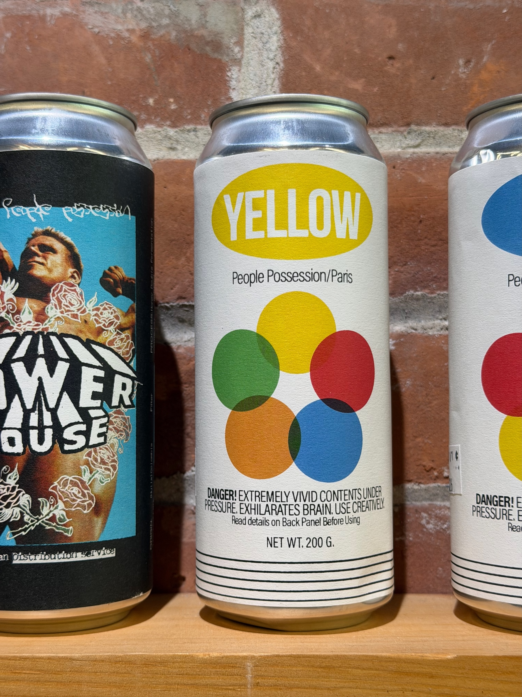
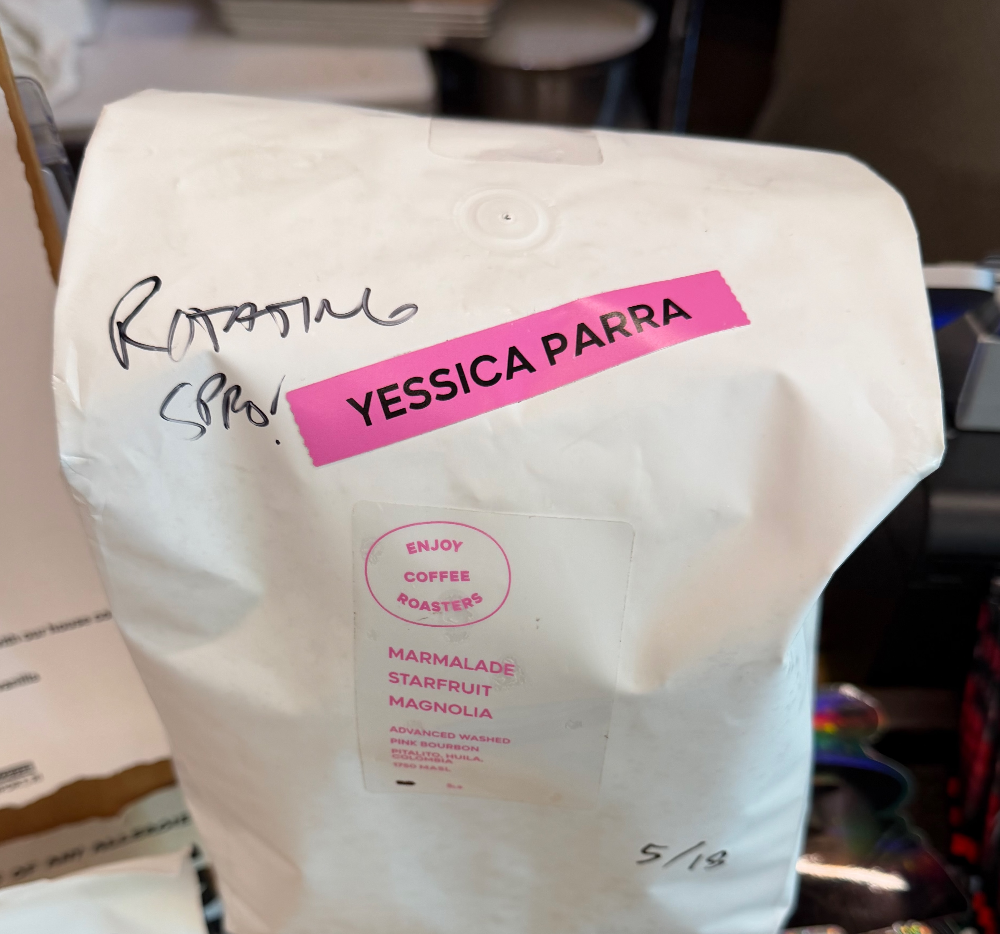

## Coffee

I don't have notes on shops, but I did buy a couple of bags of [Knicks in Five](https://enjoycoffeeroasters.com/products/knicks-in-five) from [Enjoy](https://enjoycoffeeroasters.com) because I went to Villanova, have lived close to Manhattan and generally love Enjoy as a roaster. It was a relatively cheap way for me to support the team without going to the parade. It is just a reboxing of the newest Five Points and is actually quite amazing.

In addition, my local shop, [Simple Merchant](https://www.simplemerchantcoffee.com) has had an interesting rotating coffee from [People Possession](https://peoplepossession.com) and I have to be honest, I was not a fan. I'm really glad the SMC has a bunch of different things for me to try. The coffee is the [Yellow](https://www.kofio.co/coffee/colombia-yellow-anaya-people-possession/20344) which really tastes like lemon cleaning products. Some say if you like IPAs, you might like this coffee. I did not.

I have also finished up the last of a Kenyan I bought on my way back from Colorado in Des Moines at [Horizon Line](https://www.horizonlinecoffee.com). It was a natural Kenya, and honestly, it wasn't my cup of tea either. But I'm done with that and on to new beans, so hopefully better tastes are coming my way.

SMC also switched their rotation to Yessica Parra from Enjoy, and that was really delicious. Definitely got the starfruit note on that one.

## Work

- We have been putting some more work into [Parrie](https://parriehelp.com). It is a concept to see if it can help people planning events find good locations for their events. [LinkedIn](https://www.linkedin.com/company/parrie/posts/?feedView=all)
- I've started the next project in our little adventure, called Revi. More to come on that soon, but generally speaking, it is a review platform to solve some of the issues I see with the current review platforms. Backend is coming together, but the website is nowhere near ready yet. And I'm excited because it really belongs as a Mobile app so I get to write some SwiftUI soon.
- We have sold a couple of cars with Authentic Auctions, including a really cool URQuattro from Audi. Trying to figure out how to put things together to schedule posts, but that doesn't really work well, especially with Instagram posts and adding in links.
- I'm playing around with [Basecamp](https://basecamp.com) from 37 Signals, and while I really want to like it. There are so many feature gaps that it hard to shoehorn it into the projects I want to use it on. It makes me wonder if I'm doing something wrong with the way I am using it.

## Moments

Newport 250th Logo:

Coco Pointing:

Sweat Angel:

People Posession Yellow (the one I didn't like):

Enjoy Yessica (the one I loved):

