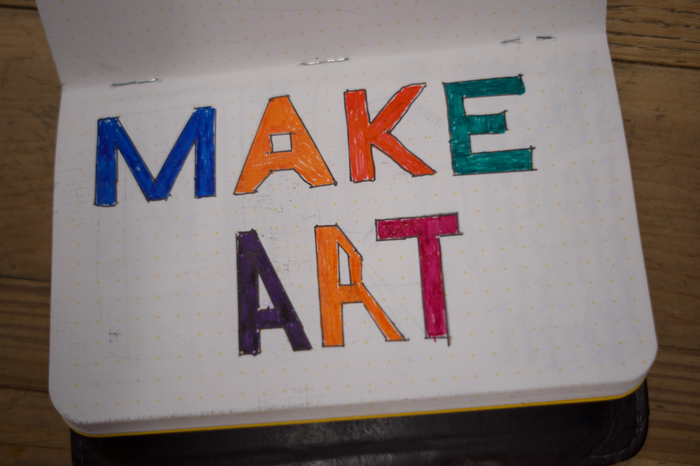
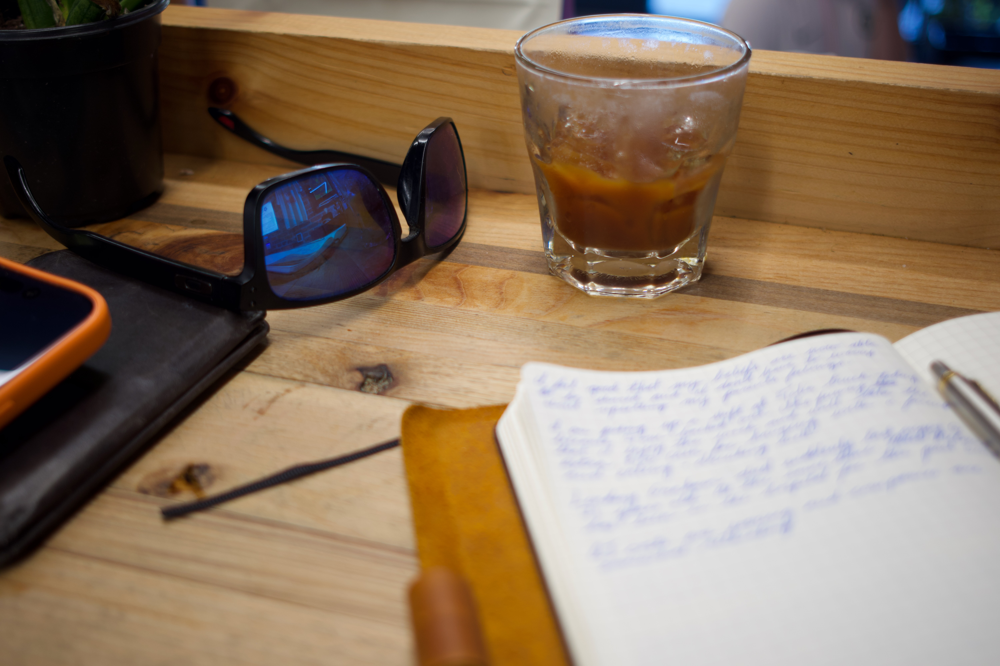
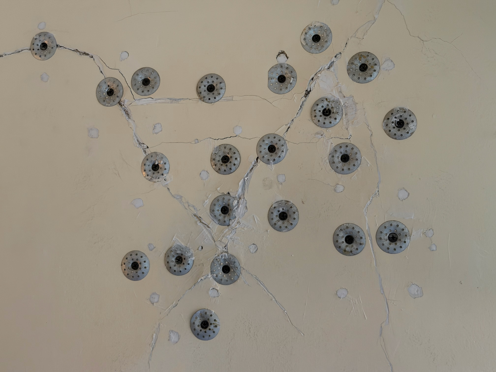
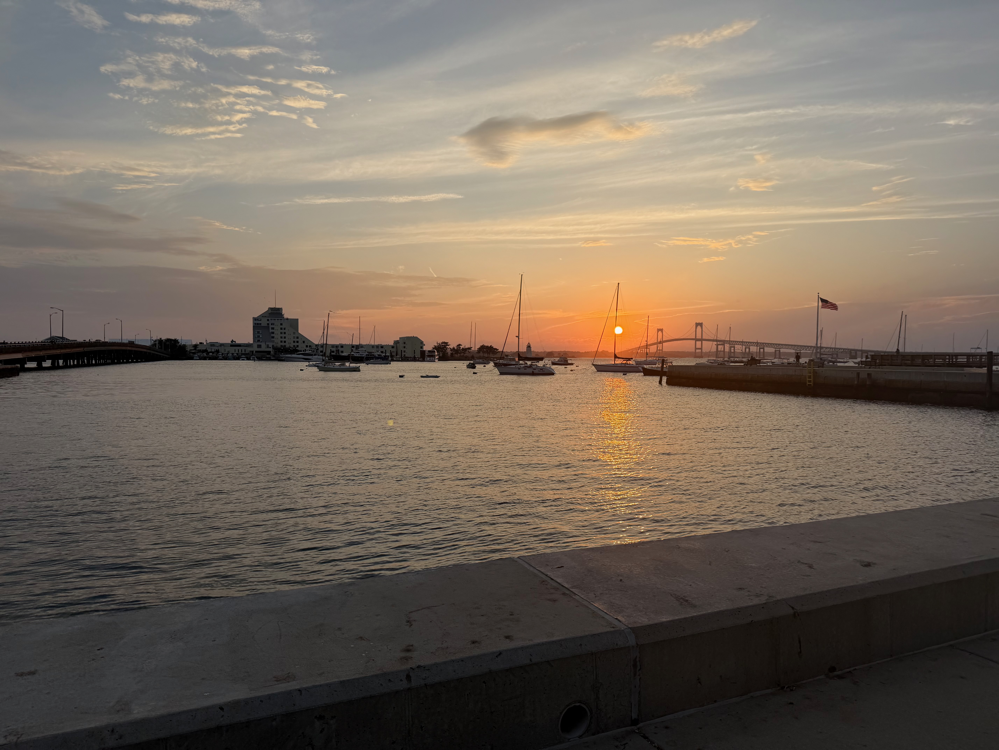

I recently saw Project Hail Mary for the first time and am now listening to the audiobook. This has gotten me thinking a lot about the work we do. In this book, they are doing work to save the planet. What would be called a "moonshot" or an audacious goal that is incredibly hard. In the case of the book, it is saving humanity on Earth.

In my main career, I'm a software engineer. I write code. In my 20+ years of programming professionally, almost nothing that I've written is still in use. Maybe some code in Bloomberg's ADSK, or Factset's client, might still be around, but nothing significant. All the shots I've really taken aren't around. They were great projects, but fell short of having the impact:

- At Motorola, we tried to develop a new version of a web-based set of tools for mobile devices. We made Montage, Screening, and Ninja. While concepts from Montage still live on, at Ford, I believe, the vast majority of what we did is done.
- At Flywheel, we attempted to bring digital hailing to the existing Cab community. This project failed because the people on the taxi side failed to see the threat of ride-hailing until it was too late. The industry changed, but my contribution was not realized.
- At RelateIQ, we wanted to help some of the smaller players do CRM better than they could with existing products. We shared our ideas with Salesforce along with our talent, but the product that I worked on was terminated and no longer exists.
- Airkit was trying to bridge the gap between data intake from customers to sales reps and confusion between different channels.
- Gluino was an attempt to solve one of the bigger issues with generative text AI by providing context to prompts and allow access to other means of tooling around generative AI.

All of these projects had high aspirations. Those are projects that I aim for. That is why I'm working on [Revi](https://revi-it.com). This project is about attempting to change the way we do reviews. The goal is to make reviews more accurate. To try and prevent one outlying experience from biasing a whole system of reviews. To shy away from leaving only 5-star or 1-star reviews.

There is a bunch more thought and energy going into this project, which is part of the Newport Technology Group project I'm working on with my partner Damon.

These projects are audacious. Crazy big, quite possibly too ambitious, but those are the projects I like to spend time on. The moonshots of software development.

## Coffee

- I've finished my first bag of [Knicks in Five](https://enjoycoffeeroasters.com/products/knicks-in-five) from Enjoy Coffee Roasters. I really did enjoy this coffee both with milk and without.
- I ordered a large bag of [Sirinya](https://enjoycoffeeroasters.com/products/sirinya-natural) from Enjoy on recommendation that is a Fruit Bomb. Can't wait to try it.
- Currently drinking some more Olympia [Little Buddy](https://www.olympiacoffee.com/collections/coffee/products/little-buddy) because I really love it.
- [SMC](https://www.simplemerchantcoffee.com) has an [Onyx Las Lajas](https://onyxcoffeelab.com/products/costa-rica-las-lajas-natural-25) Right now, that doesn't really have the fruity notes I was hoping for from the natural.

In other news, I might be seeking some guidance and advice around a new coffee project I'm thinking about. I'm considering putting together a weekend coffee truck that curates more of the 3rd wave, fruit flavored espresso that I love. I'm still working on figuring out what this is and if I can make it a reality. Just hinting at it here.

## Work

- As mentioned in the opener, I'm working on a project called [Revi](https://revi-it.com), and while the website is up, this feels like a mostly mobile experience, at least to start. So I'm actually coding for mobile again for the first time in a while. More to come on this project and the app.
- Had some updates to Authentic Auctions, had a couple of cars go through the auction, and we have even more coming this week.
- I took a day at the Tolia food truck. I still can't link the website because I haven't finished making it.
- We spent many hours working on my house before my new renters showed up for the year. I learned how to replace a gas cooktop and how to conform to code for gas shutoff valves.

## Moments

A Little notebook sketch

Journaling at SMC Coffee

Repairing the drywall in my home

B Dock Location at Goat Island

