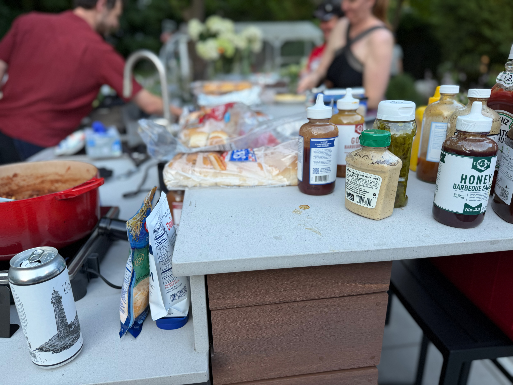
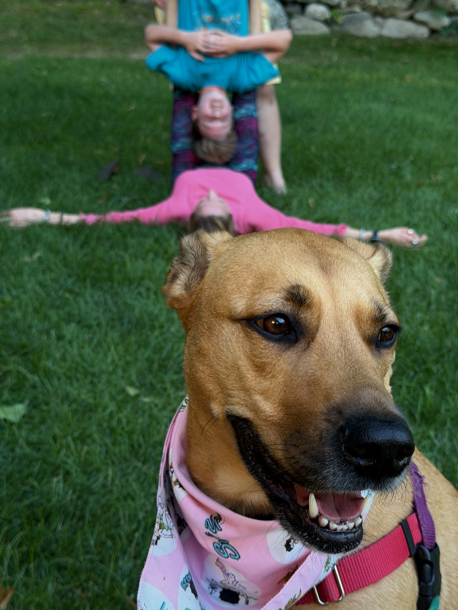
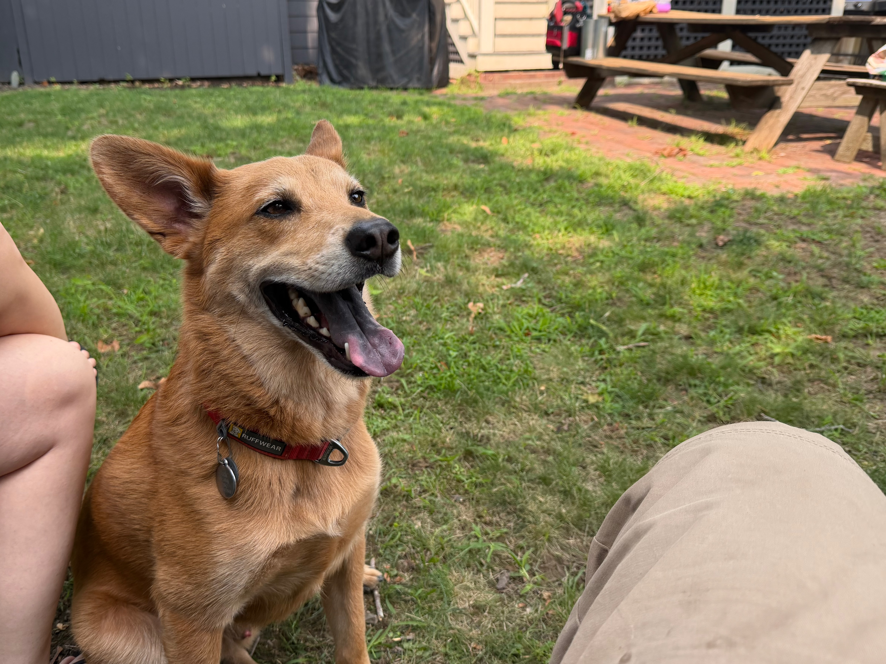
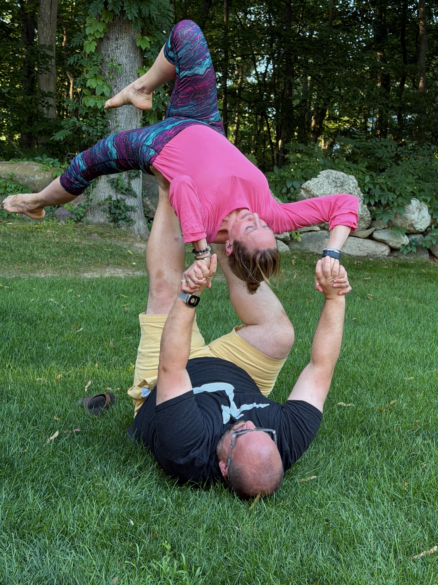
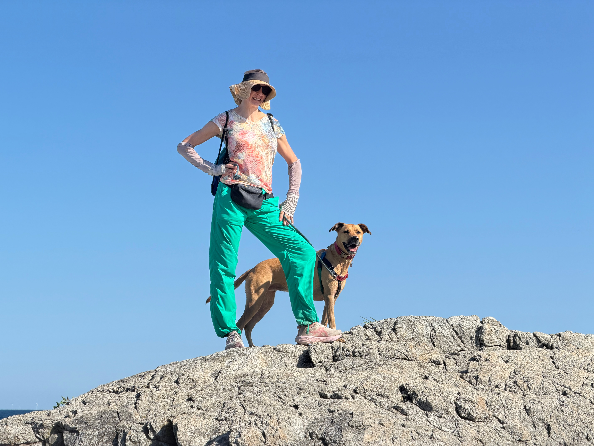
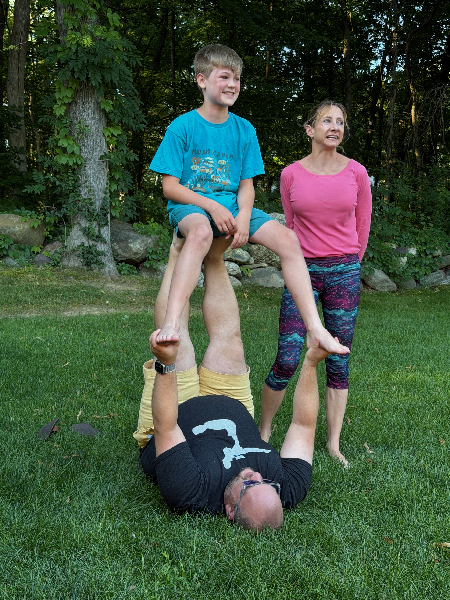
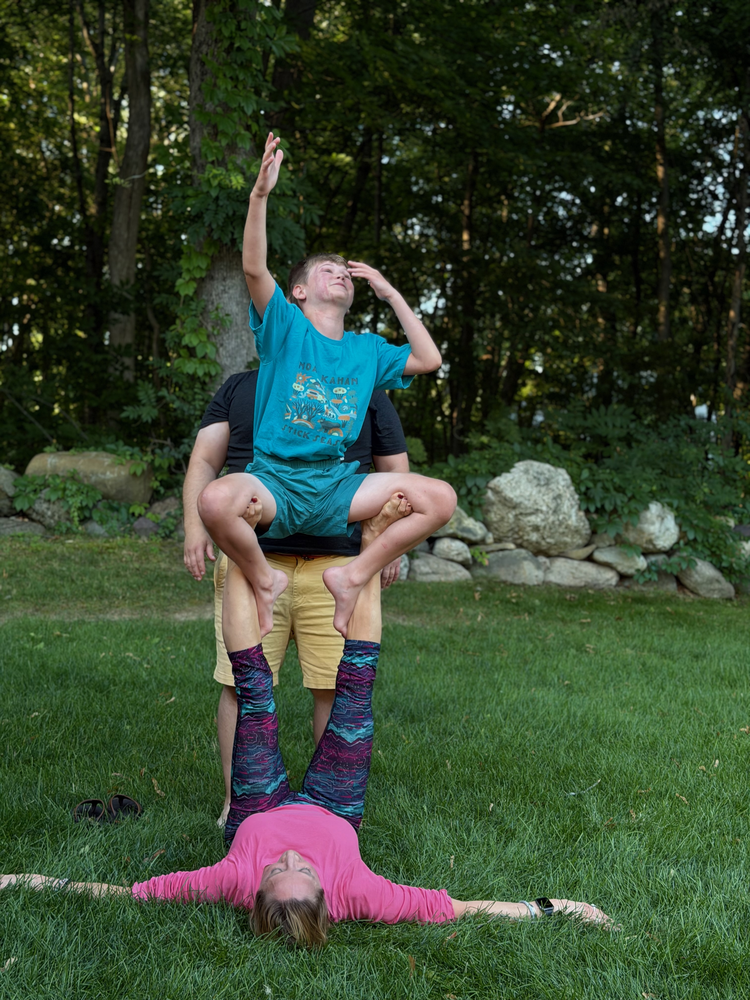

## More About Revi

I'm working on a project called [Revi](https://revi-it.com) with my [Newport Technology Group](https://newporttechgroup.com). This project is really exciting for me because it starts to set up some of the bigger things I have my eyes on within Technology.

Building on last week. Moonshots are crazy audacious by design. Some of the longer-term goals for Revi and NPT-TG are more like Mars Shots than moon shots. We need to start with the simple.

Revi is complex enough to be a full project, but is just a stop on the way to building something even more grand. Still, let's talk about Revi.

The goal of this project is to allow for repeated reviews of locations. Think of how many customers your local coffee shop handles every day. Some of those people are one-offs. They come in and get a coffee because they are in town on a visit. Some of them are regulars who come in daily or weekly. The value of the review should reflect the full experience, not just one-offs or regulars. The value of the place should be a combination of all the visits over time. Hence, the goal is to create a platform where you can rate and review interactions continually. One bad experience doesn't ruin a bunch of fantastic experiences. One fantastic experience doesn't cover a bunch of bad experiences.

The challenge is how we get there. As you can see if you visit the page, this is currently a website with reviews. You can review anything and everyone. I have been told this is very Black Mirror-like, but I haven't seen the show, so I don't fully get the reference. But I assure you my intention is nothing nefarious.

Also, while it is totally possible to make a web app do almost everything a mobile experience can do, Revi feels like it should be native to me. I'm working on a SwiftUI app that will take advantage of things like Apple's Map UI and location finding. Currently the website uses a free level of Google's Places API, but why pay when this is built into the phone experience? Anyway, mobile app is coming, and it is taking longer than I want but it is coming.

I'm sure there will be more on Revi as time goes on.

## Coffee

Lack luster week for me for coffee, so bare with me.

- On rotating espresso at SMC is [DAK Milky Cake](https://www.dakcoffeeroasters.com/shop/coffee/milky-cake?quantity=250g&roast=espresso) which has more cardamom than I like, but is still an interesting coffee. Way more appropriate than the Christmas Cardamom that they had last year.
- On rotating drip, SMC had a [DAK Cranberry Lane](https://brewfusionshop.com/products/cranberry-lane-kenya) which I drank over ice and actually really enjoyed. Worth giving it a try.
- Also, of note, while I didn't have it, after reaching out to Justin at Enjoy, he confirmed that his Decaf has 3% caffeine, which is great. Worth noting for future decaf consumption. I've also been told it tastes great.

## Work

### Construction

- I learned about installing Mr. Cool's mini-splits last week and finished up some housework at my house and the house in Portsmouth.
- I learned about gas shut-off codes in RI and installed a safety mechanism for the new tenants.
- I'm beginning to work on my first deck or egress from a home. I never realized how complex the design of these things is. It is fascinating, and I'm loving learning about the math.

### Technology

- Working on getting Revi still refined and back into building native apps. Back in the day, we used the MVC paradigm when building iOS apps; in SwiftUI, we use MVVM, which feels very similar to me, and I'm working on trying to understand how a View Model is not just another name for a controller. I think it might be because we move more code to Services or something like that.
- I'm working on a timesheet app for a local construction company. I am pretty excited about how quickly AI was able to put together a sketch to show the customer and then start with the basic layout of the app.
- Working on a new entry for Authentic Auctions [here](https://authentic-auctions-web.vercel.app/pipeline) so twe can start collecting more accurate client information and start from a more standard place for ome of our auctions going forward. The goal of this form is that either a client or one of us can enter the information for review. I'm trying to streamline some of our processes.
- I guess the fact that our [Newport Technology Group](https://newporttechgroup.com) website is up and running is another thing.

### Life

- One of my best friends, Leslie, was in town this weekend, and we got to see her and her boyfriend Allan, who is also an awesome person. I had a blast hanging out with them Sunday and Monday. We did the entire cliff walk with Coco on Monday, so that was pretty awesome.
- Went to a friend's BBQ in MA on Sunday and got to do Acroyoga with Leslie and my friend's son; he is super into it. So I need to get him hooked.
- I'm still working on episode 3 of Zack's Cracks. I've got the material and know what I want to talk about, but I need to find the time and space to record it—working on it.
- Training is ongoing with Coco (my 5-year-old puppy), and we are making some progress, but on the walk, she had a couple of moments where she just decided not to stay connected with me, and that is something we need to continue to work on.
- Coco had another play date this weekend with her BFF Jack, so you will see some photos of him in the moments too.

## Moments

Photo from the BBQ

Coco doesn't like Acro

Coco's newest trick: relax

Good boy Jack

Leslie and Allan came to visit

Leslie Backfly

Leslie and Coco on the Cliff Walk

Mono Reverse Star

Friend Son Tyler Doing Chair

Tyler doing throne

