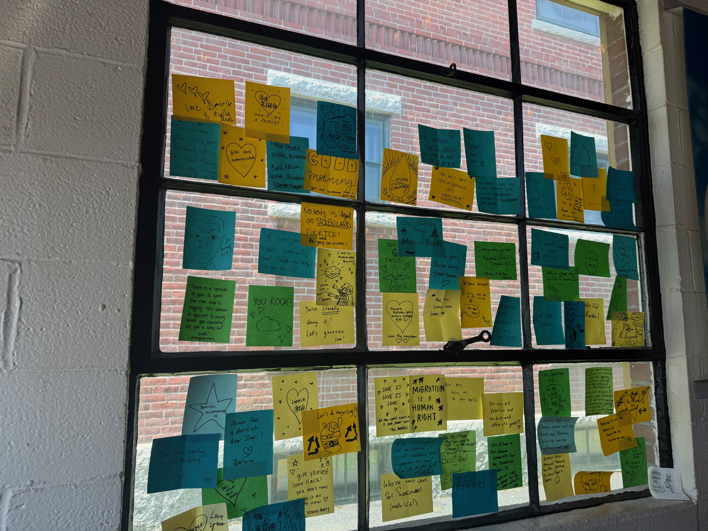
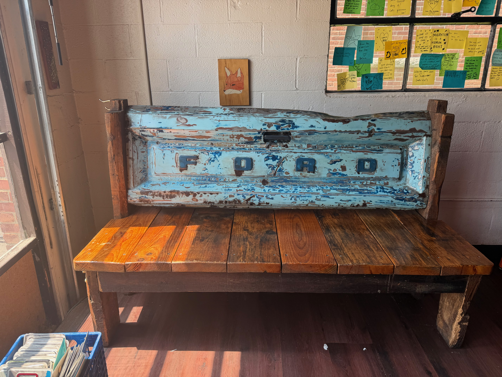
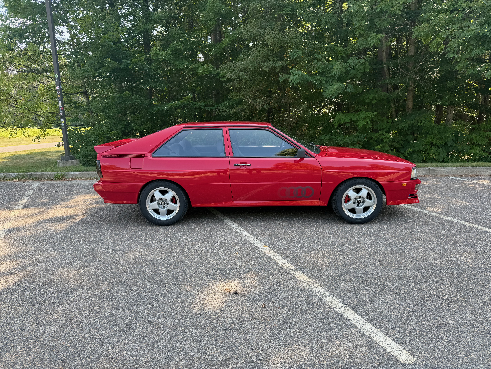
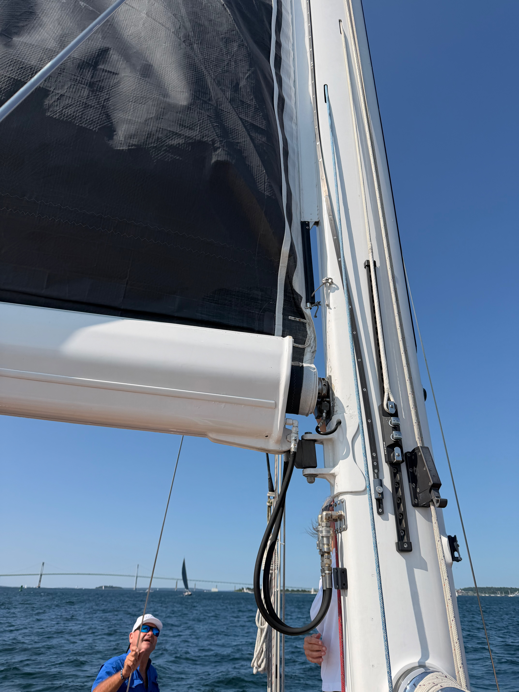
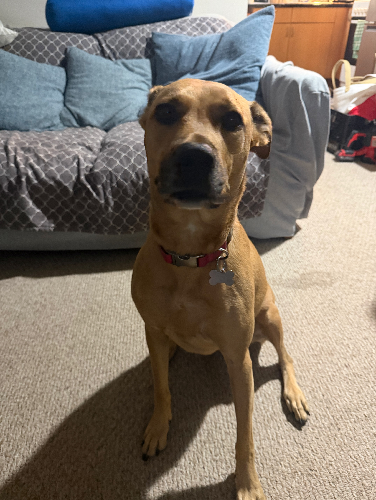

This week was a tough one. Lots of driving, sailing challenges, and personal challenges. There are also a bunch of new projects coming online that we need to talk about. I also had a falling out with a mentor of mine, which really hurt. Several times in my past, I've approached people with a belief that is counter to theirs, and they shut me down instead of letting us talk through it. This was particularly painful for me, and I debated whether it was appropriate to share, but honesty is important, so I'm sharing. I'm in pain over the loss of this relationship.

## Coffee

- [SMC](https://www.simplemerchantcoffee.com) has been cycling through a bunch of DAK Coffees. I really love [DAK](https://www.dakcoffeeroasters.com) in general, and these coffees are tasty. Most recently, it has been Cream Donut, which I liked but didn't love.
- [Lucky's Coffee Garage](https://www.luckyscoffeegarage.com) is a coffee shop I visited on my travels this week. While I don't love the coffee they carry, the place is just fantastic. It's very well styled, the energy is very welcoming, and I can't say enough good things about it. [Revi Link](https://revi-it.com/reviews/a87c2501-32f5-4593-a40b-989470f22198)

Wish I had more on coffee, but I have been focused on work.

## Work

### Construction

- Learning how to build a deck. This is significantly harder than I thought it would be. It starts with doing the math and figuring out the rules for your state. Then it comes down to digging holes and putting in concrete foundations.
- Then we started by putting in a ledger and building the box in place. We used a bunch of joist hangers to keep the wood sturdy. Next up is pouring the concrete for the landing.
- Painting is not something I love. Some people do, but I can't make things look pretty enough for me to be happy, so I still don't love it. One lesson: getting a good, clean brush is a great starting point.

### Tech

- I've continued working on the mobile app for Revi, but it is nowhere near where I want it to be. This is a SwiftUI app, but I'm going to start by focusing on Mobile and will worry about other platforms later on in the development process. Much of this process is being done by me with some help from AI, but I want to own more of this code.
- I have been working on this [form](https://authentic-auctions-web.vercel.app) for [Authentic Auctions](https://authenticauctions.com/) to work on vehicle ingestion so we can build out some standards and be ready for submitting to the auction house. This project was built with Claude, on Vercel with a Supabase backend.
- I'm still working on the timekeeping app for a local contractor.
- I'm also working on a website for the best Turkish food in all of Rhode Island.

### Other

- Beginning to work on the Jurassic Classic, a local gymnastics event at our local YMCA for adults in the area. This is not a super competitive event; its goal is to bring together the community and raise some funds for the gymnastics program. More to come on this soon.

## Moments

Lucky's Coffee Garage Wall Art

Ford Bench at Lucky's

Lucky's

Audi I shot

Sail Has a bad batten

Best For Last Coco

