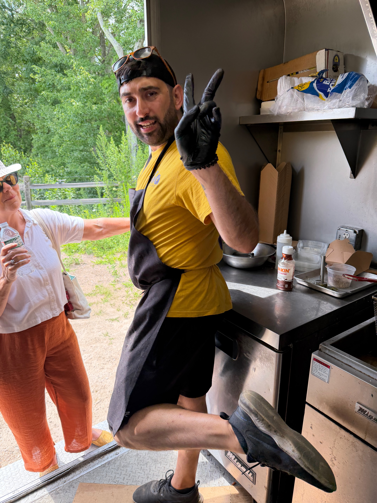
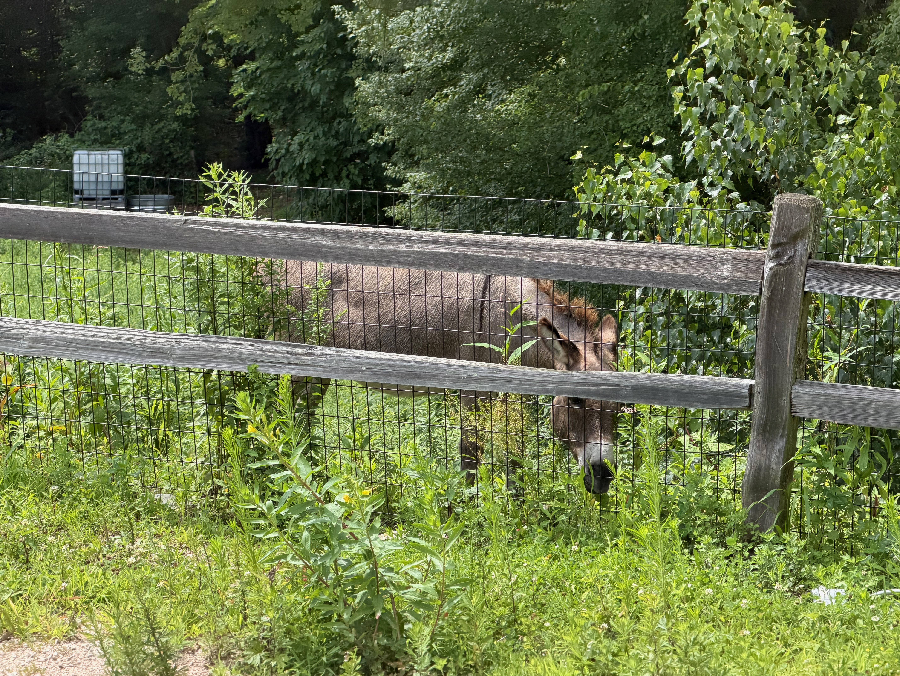
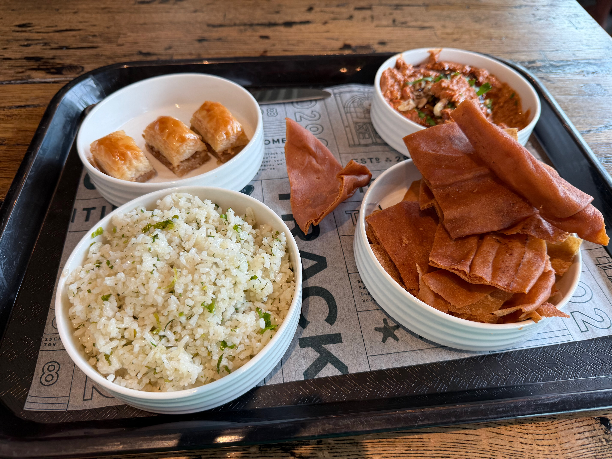
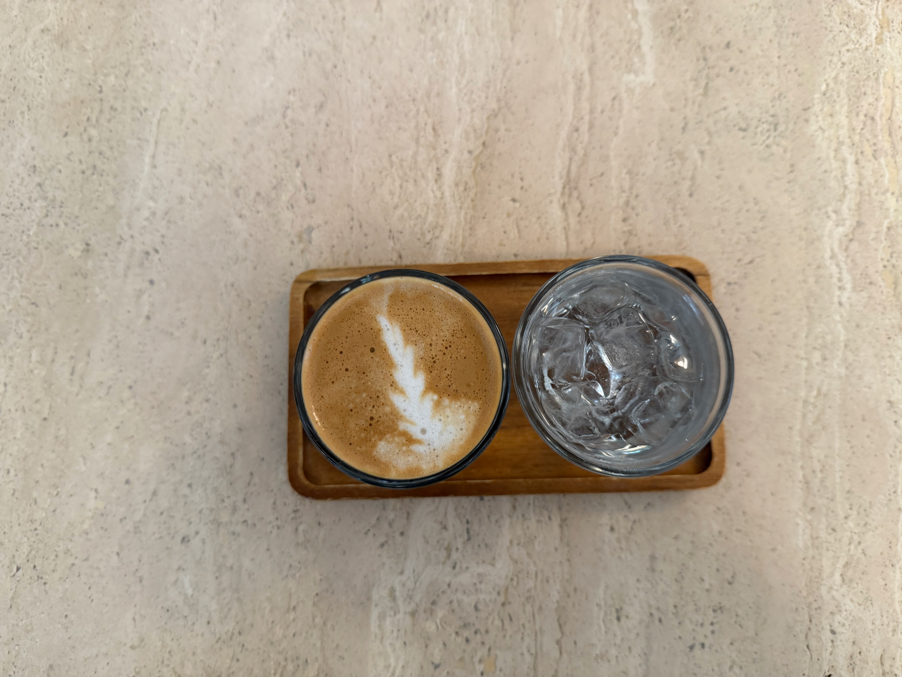
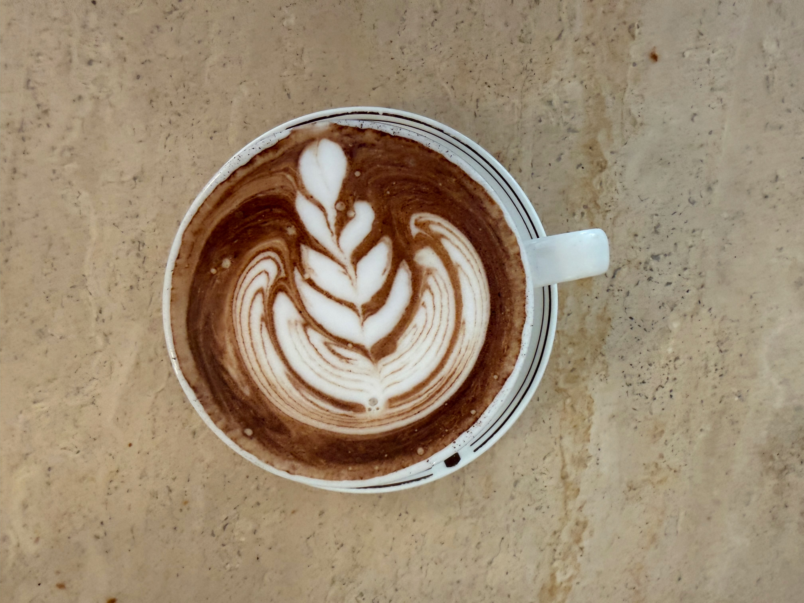
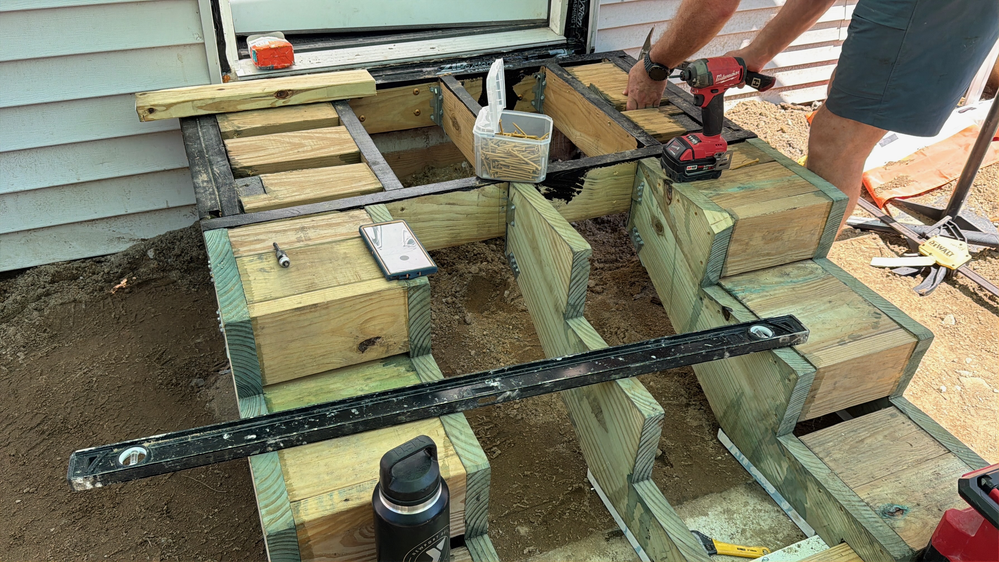

This has been a tough week to review because I've been so busy with work. I'm doing something to work every day of the week. That doesn't mean I'm working all day every day, but I'm always working. I haven't had a full rest day in the past 2 weeks, and I don't have one this week. My weekends, when I'm off construction, have been filled with working food trucks and also shooting cars for [Authentic Auctions](https://www.authenticauctions.com) and while this is tiring and hard, I described it to a friend as "good for the soul" for me. I like being busy. I like working on a lot of things. I like accomplishing things.

## Coffee

- I'm still finishing up a bag of Little Buddy from [Olympia Coffee Roasters](https://www.olympiacoffee.com). I use this coffee for iced lattes, espressos, and even flavored drinks at home. It's a very diverse coffee for me.
- I've been drinking DAK at SMC, and honestly, it's a little too complicated for me. I want something simple and fruity, and that isn't what DAK does.
- I also went to the [Brown Bee](https://brownbeecoffee.com) for a cortado with some friends, and while the place always is wonderful, the quality of the coffee was not there. It was too chalky and very chocolatey; even with the milk, it just didn't work. If you are paying the prices here, I have higher expectations.

I am also continuing to work on a secret coffee project I will be talking about more soon. Wait for details.

## Work

### Construction

- This week has been a lot of construction. We are still working on decks. This process is getting better every time we do it, and I'm pretty convinced that our second deck is going to be built in a fraction of the time it took to construct the first deck.
- First time I've poured concrete, mixed it in a bucket, and filled a 4-foot form for a post. Since my stint in farming, I've loved digging holes, especially with the correct tools and plans. It was great to dig the holes for the posts.
- Figuring out the math for stringers is definitely a new type of math for me. Most of construction is done with 30/60/90 triangles, but because heights are not always specific, you don't get to deal with those angles in the construction of a stringer. A stringer is the base of stairs. You can get [premade stringers](https://www.homedepot.com/p/4-Step-Ground-Contact-Pressure-Treated-Pine-Stair-Stringer-279713/301040013), but again, this doesn't work if you have exact heights you need for the stairs.
- Lastly, we did what we called a picture frame top of the stairs to keep the front of the stairs looking clean. This means mitering the deck board so the only unfinished edge seen is against the wall.

### Technology

- I'm still working on Revi, but the mobile app is taking longer than I would like. Building with Claude inside Xcode has been pretty limiting. I've also been really busy with other projects and haven't had the time to sit at the desk and develop this project. More to come on this project.
- I've been working on a customer submission form for Authentic Auctions [here](https://authentic-auctions-web.vercel.app/cars/new) so that users can enter their data themselves.
- Working on a computer script for resizing images for the auction space. BaT, Cars and Bids, and PCar all have their own standards for image sizing. We often find ourselves in a situation where images need to be downsampled to a certain size or resolution. This is the perfect task for a shell script, so I've been working on a couple of tools for our Authentic Auctions project to speed up our tasks.
- I'm in the process of building out a site for a new gymnastics competition at the Newport County YMCA: [Jurassic Classic](https://jurassic-classic.com).
- I'm still working on a timekeeping app for a local construction company. Built with Next and Supabase, much of this is done by Claude, and I'm guiding more of the design decisions. We still have a bunch of UI to figure out.
- I'm trying to get all the way through the Tolia website project. This project has been going on for nearly two years. The restaurant is killing it and just doesn't have a site. I am also working the food truck several days a month.

## Design

One of my new projects is trying to design a sticker a week. I'm not really sitting on sticker money these days, but that doesn't mean I can't have fun designing them. This week's sticker is a throwback to a couple of weeks ago. Obviously called "Moonshot."

## Moments

Alp at the Foodtruck

Donkey at Titled Barn

Tolia Food at Track 15

Cortado at Brown Bee

Spanish Latte at Brown Bee

Stairs Construction

