_Note: this is a three-week post because I lost track of time last week._

My premise is that most software engineering is broken these days. What I mean by that is that the majority of software engineering is done for the growth of wealth, without a true focus on the ethical impact of the software being developed. No, this is not a rant about how AI is bad; it is more a lament that most of the software I have written is dead.

I have been writing software professionally since 2005, when I graduated from college. During that time, much of what I've written has been used and thrown away. That may reflect how I choose projects, but when I talk to my friends, a lot of the software they have written has been thrown away too. Software used to be written and used for decades. It feels like current software has a shelf life much shorter than in years past.

It makes me wonder if this is the cycle of things for software. Each version of software lasts shorter and shorter intervals. As AI helps us write more code, we can churn out new software faster and replace existing software. The problem is that as more of this code is written, just like in higher-level languages, we end up with extra code bloat. The move from punch cards to assembly meant we could write faster, but we didn't have to be as efficient. As we move up the stack and get further and further away from hardware, we end up having more and more abstraction and code bloat, and AI is only adding to that.

I miss the efficiency of lower-level languages. Their speed and accuracy were also nice.

## Coffee

- I'm finally drinking the Thailand Coffee from [Enjoy](https://enjoycoffeeroasters.com), but it is already sold out and no longer on their site. It's interesting and I like it, but more on their own, not with milk. It is part of [Newbery Street's](https://newberyst.com) initiative to bring coffee from Thailand to market. Side note: Newberry is trying to open their own location by raising money on [Kickstarter](https://www.kickstarter.com/projects/newberystreetcoffee/newbery-street-coffee-roasters/). I've donated; hope you will consider it too.
- I went to [Dissent](https://www.yelp.com/biz/dissent-pawtucket) with Chad Baguette the other week and had a very fantastic coffee that I cannot remember the name of. But this coffee shop is crazy awesome. They have four pages of menu (3 are coffees and one is tea). I got something that was supposed to and actually did taste a bit like butterscotch.
- Hot take: the mixology at [No Vacancy](https://www.novacancycoffee.com/) is fire. The Shaken Mint, which just came off the menu, is pretty awesome. So is the Dirty Doctor, which is a sweetened Doctor Pepper. I feel like their straight coffee is a little bitter but the flavors in their mixed drinks are unmatched.
- My trip to Long Island allowed me to check out https://www.northforkroastingco.com/. The shop is super cute, and the vibe was great, and it was packed, but their espresso drinks weren’t really that good. No art, served too hot, and the milk didn’t have texture.
- For Five in Garden City, NY. This is another one I tried while shooting cars in Long Island. I had two americanos; the first one was pretty tasty, so I got a second. I didn't finish the second one.
- On a Trip to Guilford, I discovered [Camper Coffee](https://www.campcoff.com) which is a small camper in Madison, CT that has some crazy coffee drinks. I have since gone twice. Their flavored lattes are pretty amazing, especially since they're making them in a camper. I had the short stack and would recommend.

## Work

- I'm continuing to work on [Revi](https://www.revi-it.com). I have done no branding around it, so that is also something I'm struggling with. More to come on this project soon.
- Authentic Auctions is having a super bold month. Much of what I have been doing is traveling, shooting, and editing for the company. We also have a new website coming down the line.
- **Construction:** We have been working on putting in a fence around a small fish pond at a client's home. The fence was part glass and part aluminum, and this made it an adventure. The glass is very heavy, and I was worried the whole time we were moving it.
- I have also been working weekly at the Tolia food truck. While this is super fun, it is also draining.
- There is a new web project coming down the line for a friend of mine about pet concierge services. More to come shortly.
- I have been working on trying to get the [Jurassic Classic](https://jurassic-classic.com) off the ground. We have some people signed up but are still working on the date and information related to it.

## Moments

New episode of Zack's Cracks is live: [Episode 3](https://youtu.be/HuGHKe5TrgU?si=cu2Le9Tp5aTL6FO6)

Camper Coffee Coffee
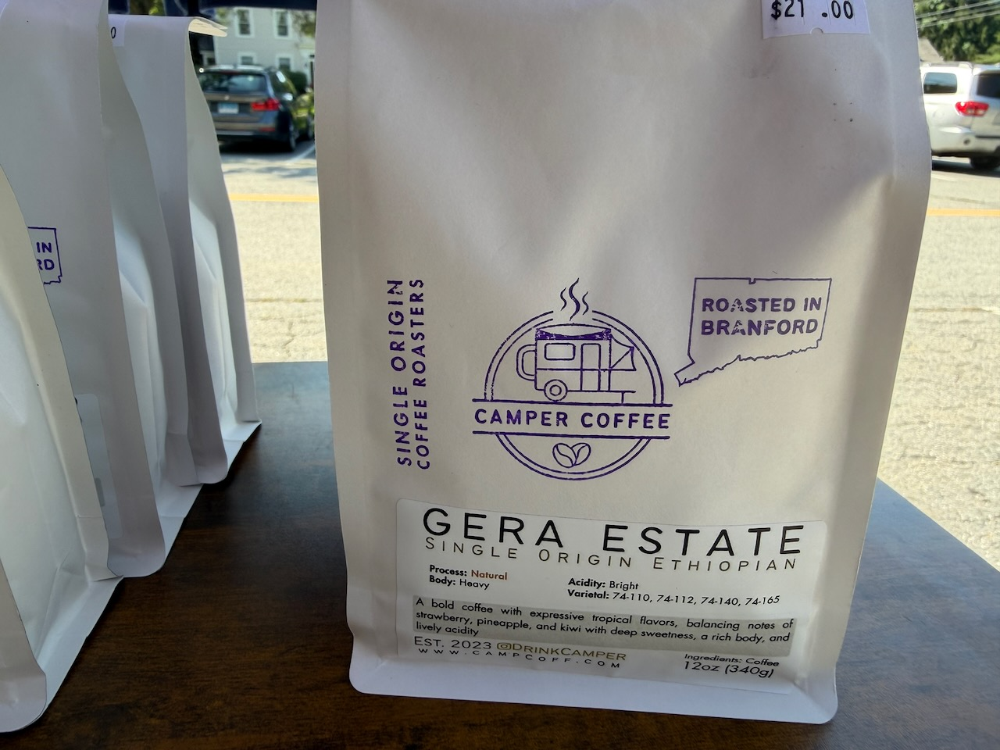

Camper Coffee
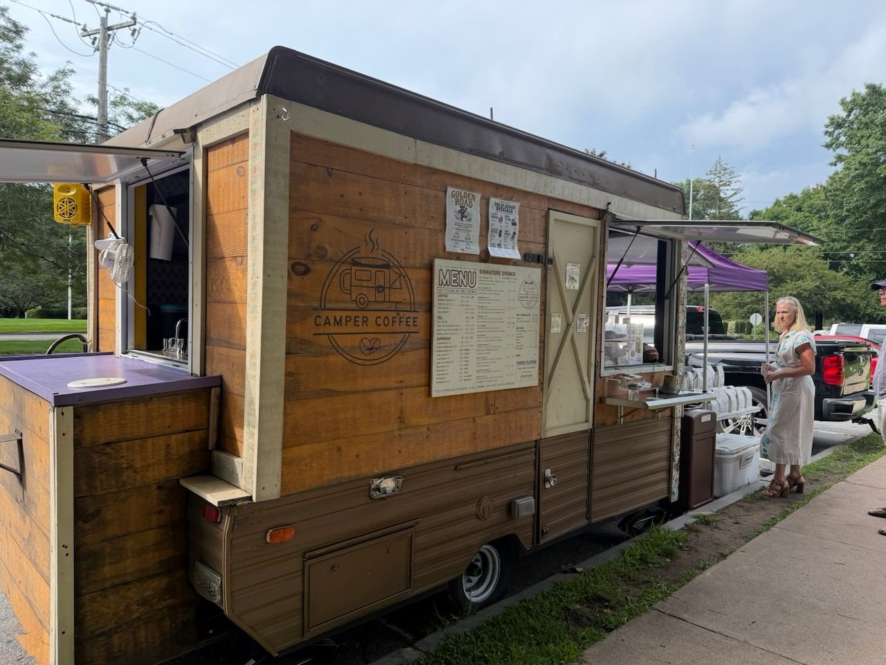

Coco
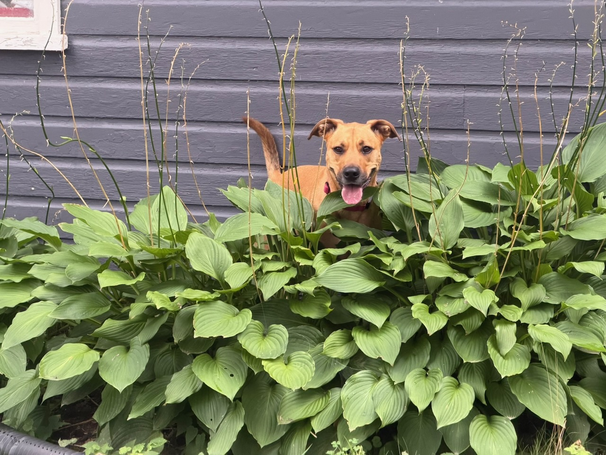

Dad in his environment
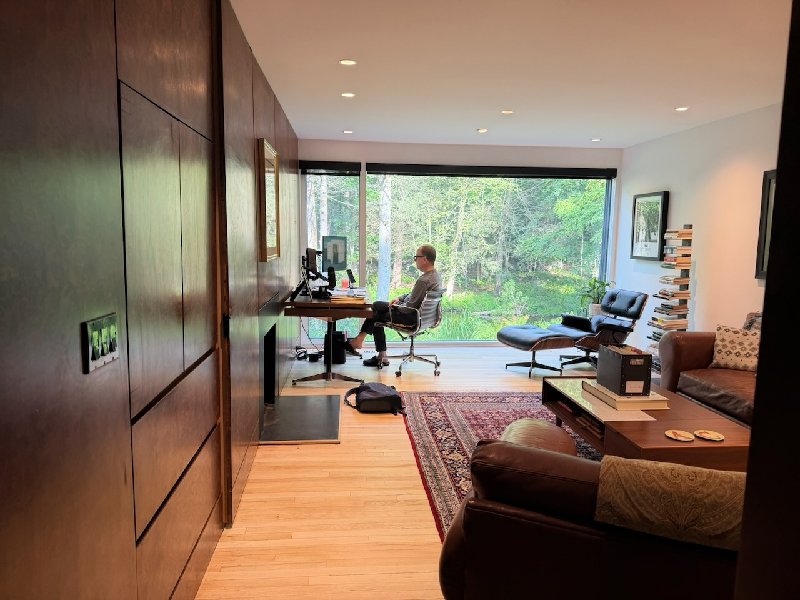

Mom
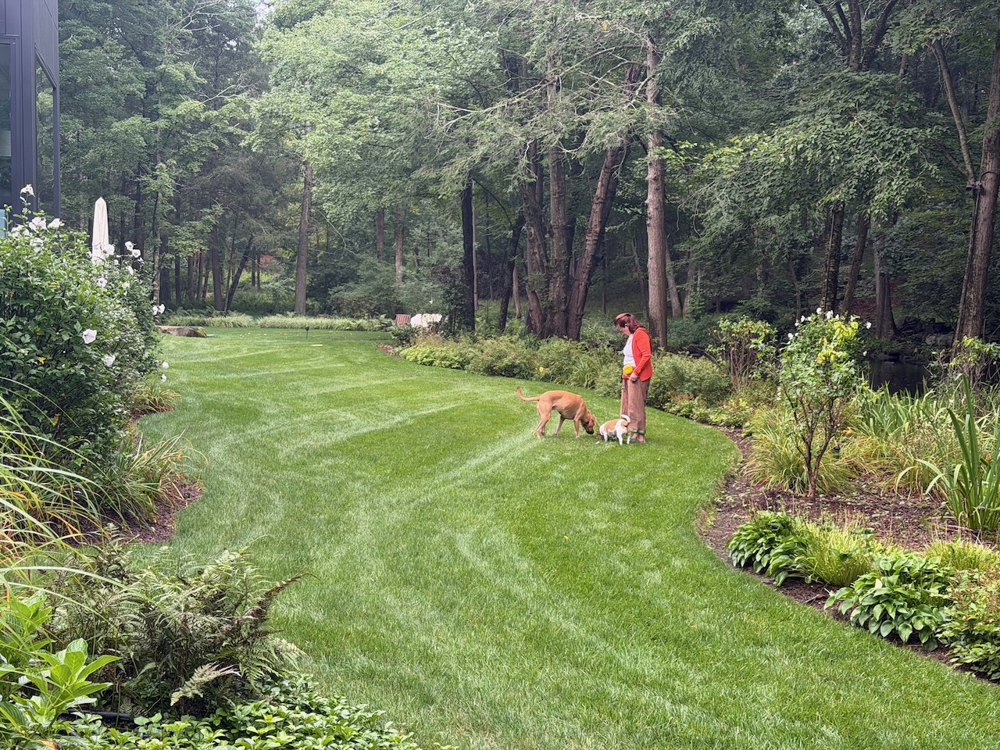

Dissent Coffee
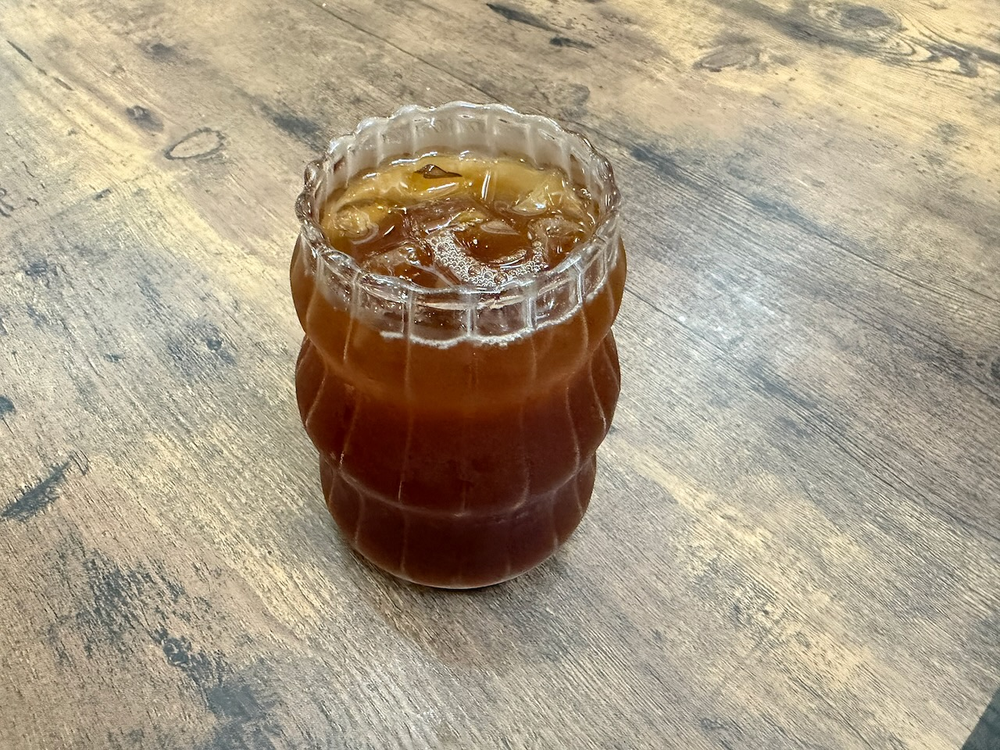

Ferry
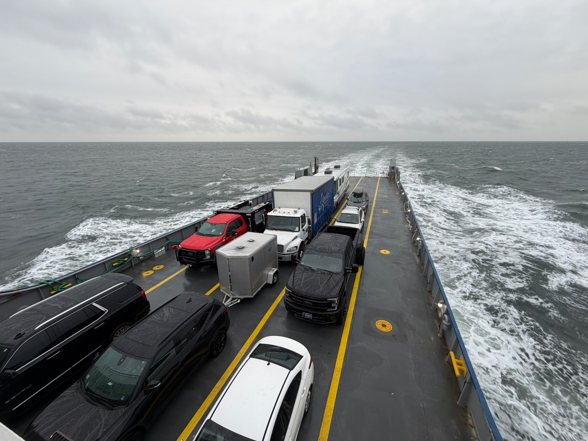

For Five
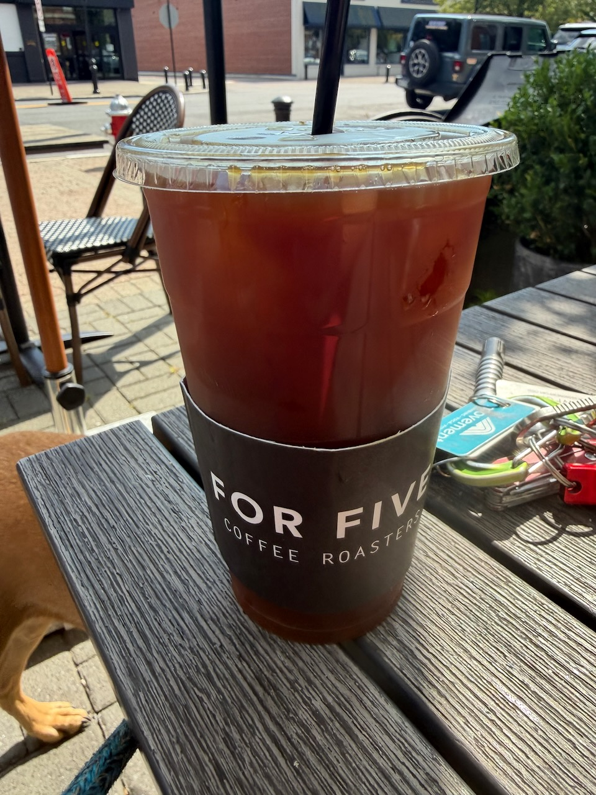

For Five Inside View
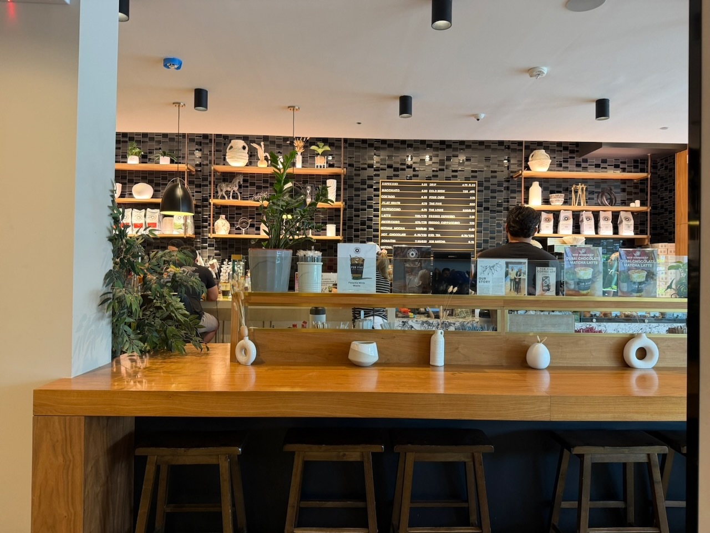

Lighthouse from the Ferry
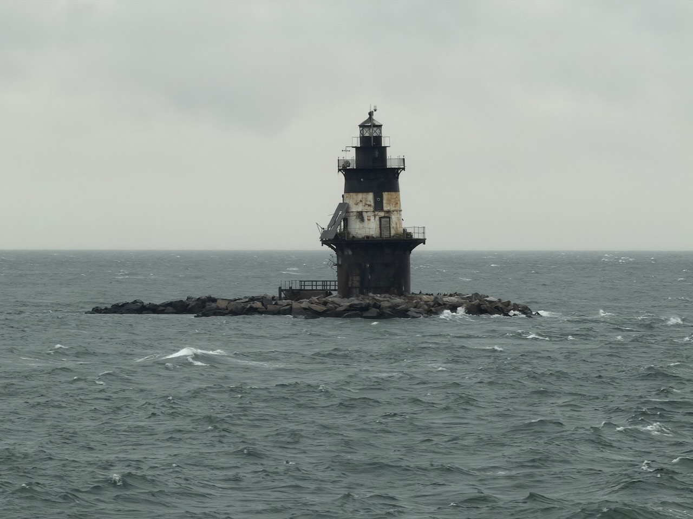

Ragged Island Pirates (best beer)
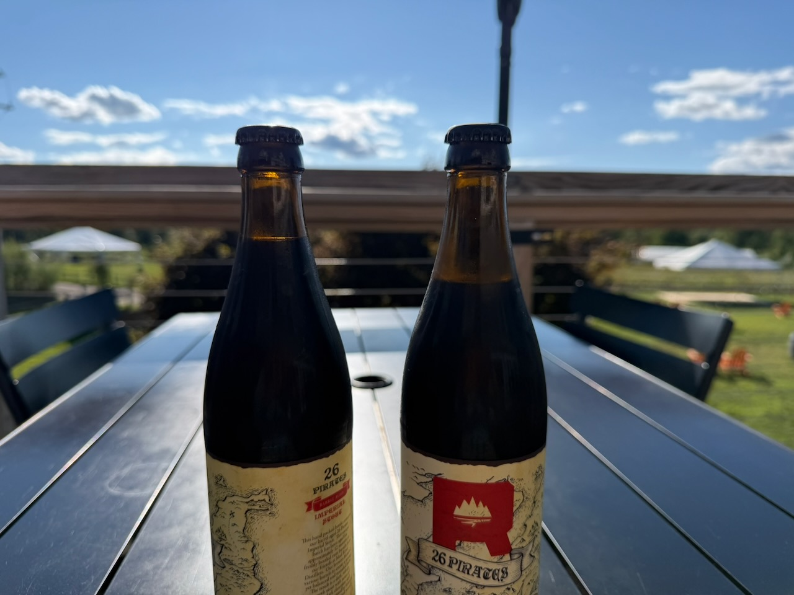

Warren Folks Fest
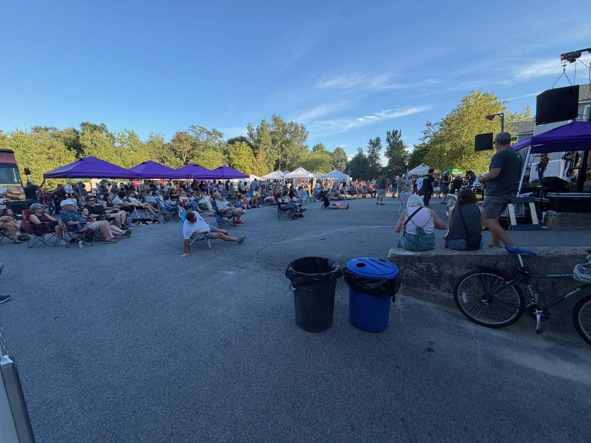

Woodland Baking
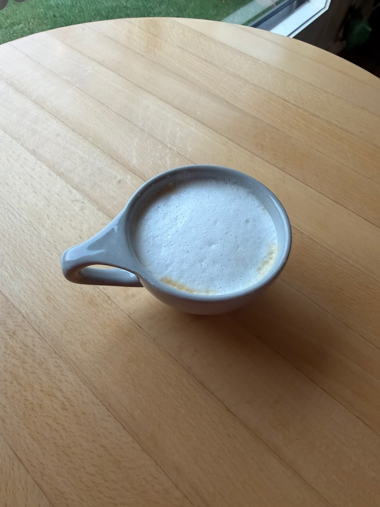
